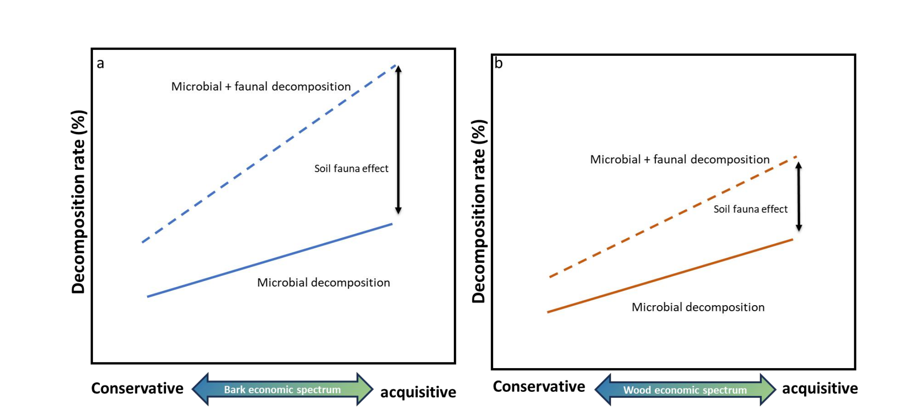
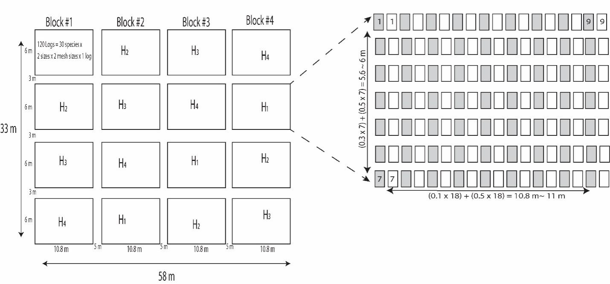
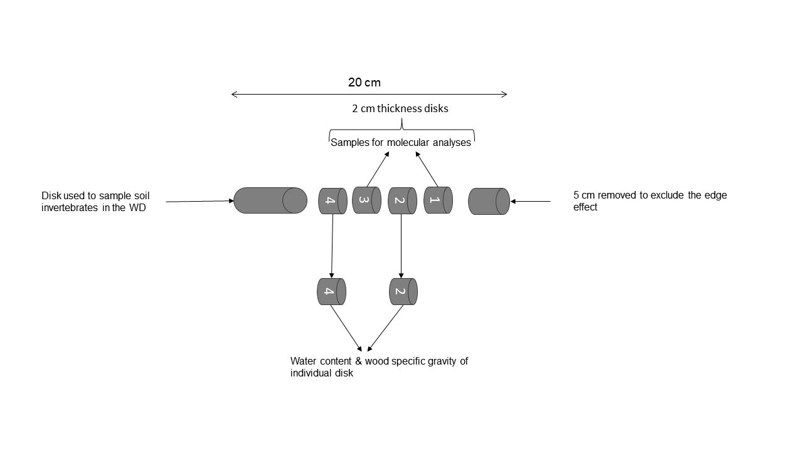

```{r setup, include=FALSE}
knitr::opts_chunk$set(echo = TRUE,warning = FALSE, message = FALSE,cache=TRUE)
```


# Introduction
This R script records Njoroge et al 2024 field experiment examining the effect of woody debris size, soil fauna status and phylogenetic signals on lianas wood decomposition. The experiment was carried out in Xishuangbanna Tropical Botanical Garden,  Chinese Academy of Sciences (XTBG/CAS) in a common garden. In the experiment 30 species of lianas were used (see below for the phylogeny tree). To test for the diameter effect we used 2.0 cm and 4.0 cm woody debris diameter. To test for soil fauna effect we used litterbags of different mesh sizes to include or exclude soil fauna based on their size in order to evaluate the effect of soil fauna on wood decomposition. We have thirteen initial chemical traits including carbon, nitrogen, lignin, etc. from both wood and bark.

This work is based on the following conceptual **figure 1**


**Figure 1:** Conceptual framework on which the current study is based on. We explore how (a) bark economic spectrum and (b) wood economic spectrum influences microbial and faunal wood decomposition. 


The experiment was carried out in a common garden in XTBG, Yunnan, Southwest China between 2022 to 2024.
The common garden plot was 58 m long and 33 m wide and was divided into four main blocks (replicates) with a five-meter spacing between blocks. The blocks were subdivided into to four sub-plots (10.8 m x 6 m) with a three-meter spacing between the subplots (Fig S1). 
In total we have `r (30*2*2*4*4)` **woody debris** 


**Figure S1:** Experiment design and the division of experiment plot. The experiment included four blocks and each block was divided into 4 sub-plots representing each harvest. Grey filled rectangles represent fine mesh size litterbags while the white ones represent the coarse mesh sizes. In total, we have `r (30*2*2*4*4)` woody debris (WD).

# Load libraries

```{r, results='hide',warning=FALSE,message=FALSE}
library(dplyr)
library(tidyverse) # for stacking and selecting
library(lme4) # for doing linear mixed effect models
library(lmerTest) # for getting p values not provided by lme4
library(MuMIn) # for model selection
library(ggplot2) # for graphics
library(readxl) # for 
library(V.PhyloMaker) # for phylogeny tree construction
library(V.PhyloMaker2)
library(patchwork) # for patching different panels or figures together
library(readr) # reading in the data
library(kableExtra)  # make HTML tables
library(tidyr)
library(ggtree)
library(phytools)
library(phylobase)
library(ggpubr)
library(ggrepel)
library(FactoMineR)
library(factoextra)
library(clusterSim)
library(ggcorrplot)
library(car)
library(arm)
library(reshape2)

```

# Data input

## Phylogeny tree

The liana species used in this experiment are from 30 species belonging to 14 families. Here we plot the phylogenetic tree using V phylomaker package.

```{r, message=FALSE, warning=FALSE}
example <- read.csv("species_phylogeny_exp1.csv")
tree.a <- phylo.maker(sp.list = example, tree = GBOTB.extended, nodes = nodes.info.1, scenarios="S3")
write.tree(tree.a$scenario.3, "Figure.1a.tre")
plot(tree.a$scenario.3)
tr<-tree.a$scenario.3
plot(tr)
```


## Initial chemical traits data 

Each chemical trait [carbon (C), nitrogen (N), phosphorus (P), magnesium (Mg), manganese (Mn), calcium (Ca), potassium (K), silicon (Si), acid-detergent fiber (ADF), acid-detergent lignin (ADL), neutral fiber detergent (NDF), Total sugars, condensed tannins)] were measured for each species for the two diameters used in this experiment (~2.0 cm and ~ 4.0 cm diameter). Wood and bark samples were grounded separately to measure the chemical traits. For some species there was no bark that could be used to measure the initial traits and are therefore missing. The initial chemistry is recorded in the file named "Exp1_initial_chemistry.csv". Latter on, we explain how ADL, NDF, and ADF were used to get lignin, cellulose, and hemicellulose.

```{r, results='hide',warning=FALSE,message=FALSE}
traits<-read.csv("Exp1_initial_chemistry.csv", header = TRUE, sep = ",", quote = "\"",
                 dec = ".", fill = TRUE, comment.char = "",fileEncoding = 'latin1')

in_trait<- traits%>% dplyr::select(species, diameter_class, wood_bark, T_C, T_N,Tannins, NDF_per, ADF_per,ADL_per,Ca_g_kg,K_g_kg,Mg_g_kg,Mn_mg_kg,P_g_kg,T_sugar_per,T_Si_g_kg)

summary(in_trait)
in_trait$species<- as.factor(in_trait$species)
in_trait$diameter_class<- as.factor(in_trait$diameter_class)
in_trait$wood_bark<-as.factor(in_trait$wood_bark)
summary(in_trait)
```

### Data exploration

#### Do initial traits vary across tissues (wood vs. bark) and across diameter?

```{r, results='hide',warning=FALSE,message=FALSE}
# calculate cellulose and hemicellulose
# To do so here we use the equations provided by Chen et al., 2012 plos one.
# Lignin= Acid detergent lignin (ADL)
# Hemicellulose = Neutral detergent fiber (NDF)–Acid detergent fiber (ADF);
# Cellulose = Acid detergent fiber (ADF) - Lignin;
# Total nonstructural carbohydrate = 100-NDF-Crude protein-Lipid-Ash.
in_trait$cellulose <- in_trait$ADF_per- in_trait$ADL_per
in_trait$hemicellulose <- in_trait$NDF_per-in_trait$ADF_per
```

To check whether these traits individually vary between wood and bark and across diameter, we run a linear mixed effect model.

##### Initial carbon

```{r, results='hide',warning=FALSE,message=FALSE}
hist(in_trait$T_C) #not bad
carb_av2<- lmer(T_C~ diameter_class*wood_bark +(1|species),data = in_trait)
anova(carb_av2)
r.squaredGLMM(carb_av2)
carb_av3<-update(carb_av2, .~.-diameter_class:wood_bark)
summary(carb_av3)
anova(carb_av3)


#Create a graph, carb to hold the carbon panel as we will call these later to put panels together
carb<- ggplot(data = in_trait, aes(x = wood_bark, y =T_C/10)) +
  geom_boxplot(aes(fill = wood_bark), color = "black")+ scale_fill_manual(values = c("wheat4", "yellowgreen"))+
  labs(x= "Woody debris tissue", y= "Total carbon (%)", fill= "Tissue", title = "a")+
  annotate("text", x = 1.3, y = 52, size=5.5, hjust=0.5,label = expression(paste( F["(1,190)"],"   =   156.60"))) +
  annotate("text", x = 1.3, y = 50, size=5.5, label = "p < 0.001") +
  theme_bw()+
  theme(text = element_text(size = 14,face="bold"), 
        axis.line = element_line(colour = "black"),
        panel.border = element_rect(colour = "black", fill=NA, size=1.5),
        axis.text = element_text(size=12, face= "bold"))+ theme(legend.position = c(0.7, 0.25))

#carb
```

Total carbon is significantly different between bark and the underlying wood.
Woody debris diameter is not having a significant effect on C.

##### Initial nitrogen

```{r, results='hide',warning=FALSE,message=FALSE}
hist(in_trait$T_N)
hist(log(in_trait$T_N))#not bad
nitr_av2<- lmer(log(T_N)~ diameter_class*wood_bark+(1|species),data = in_trait)
anova(nitr_av2)
r.squaredGLMM(nitr_av2)
nitr_av3<-update(nitr_av2, .~.-diameter_class:wood_bark)
summary(nitr_av3)
anova(nitr_av3)

#Create a graph, nit to hold the panel of nitrogen as we will call these later to put panels together
nit<- ggplot(data = in_trait, aes(x = wood_bark, y =T_N/10)) +
  geom_boxplot(aes(fill = wood_bark), color = "black")+ scale_fill_manual(values = c("wheat4", "yellowgreen"))+
  labs(x= "Woody debris tissue", y= "Total nitrogen (%)", fill= "Tissue", title = "")+
  annotate("text", x = 1.7, y = 3, size=7, hjust=0.5,label = expression(paste( F["(1,190)"],"   =   371.96"))) +
  annotate("text", x = 1.67, y = 2.7, size=7, label = "p < 0.001") +
  theme_bw()+
  theme(text = element_text(size = 14,face="bold"), 
        axis.line = element_line(colour = "black"),
        panel.border = element_rect(colour = "black", fill=NA, size=1.5),
        axis.text = element_text(size=12, face= "bold"))+ theme(legend.position = "none")

#nit
```


Total nitrogen is significantly different between bark and the underlying wood. But N does not change with diameter class.


##### Initial condensed tannins

```{r, results='hide',warning=FALSE,message=FALSE}
in_trait$Tannins<- as.numeric(in_trait$Tannins)
hist(in_trait$Tannins)
hist(log(in_trait$Tannins))#not bad
tani_av2<- lmer(log(Tannins)~ diameter_class*wood_bark +(1|species),data = in_trait)
anova(tani_av2)

tani_av3<-update(tani_av2, .~.-diameter_class:wood_bark)
summary(tani_av3)
anova(tani_av3)


#Create a graph, Tani_plot to hold the panel condensed tannins as we will call these later to put panels together
tani_plot<- ggplot(data = in_trait, aes(x = wood_bark, y =Tannins)) +
  geom_boxplot(aes(fill = wood_bark), color = "black")+ scale_fill_manual(values = c("wheat4", "yellowgreen"))+
  labs(x= "Woody debris tissue", y= "Condensed tannins (%)",title = "")+
  annotate("text", x = 1.5, y = 13.2, size=7, hjust=0.5,label = expression(paste( F["(1,184)"],"   =   130.28"))) +
  annotate("text", x = 1.5, y = 11.2, size=7, label = "p < 0.001") +
  theme_bw()+
  theme(text = element_text(size = 14,face="bold"), 
        axis.line = element_line(colour = "black"),
        panel.border = element_rect(colour = "black", fill=NA, size=1.5),
        axis.text = element_text(size=12, face= "bold"))+ theme(legend.position = "none")

#tani_plot
```

This shows that there is no significant differences of condensed tannins between diameters classes. Condensed tannins are  significantly different between bark and the underlying wood.

##### Initial cellulose

```{r, results='hide',warning=FALSE,message=FALSE}
hist(in_trait$cellulose)#not bad
hist(log(in_trait$cellulose))#not bad
cell_av2<- lmer(cellulose~ diameter_class*wood_bark +(1|species),data = in_trait)
anova(cell_av2)
r.squaredGLMM(cell_av2)
cell_av3<-update(cell_av2, .~.-diameter_class:wood_bark)
summary(cell_av3)
anova(cell_av3)


#Create a graph, cell_plot to hold the cellulose panel as we will call these later to put panels together
cell_plot<- ggplot(data = in_trait, aes(x = wood_bark, y =cellulose)) +
  geom_boxplot(aes(fill = wood_bark), color = "black")+ scale_fill_manual(values = c("wheat4", "yellowgreen"))+
  labs(x= "Woody debris tissue", y= "Cellulose (%)", fill= "Tissue", title = "")+
  annotate("text", x = 1.4, y = 60.5, size=7, hjust=0.5,label = expression(paste( F["(1,191)"],"   =   193.70"))) +
  annotate("text", x = 1.4, y = 56, size=7, label = "p < 0.001") +
  theme_bw()+
  theme(text = element_text(size = 14,face="bold"), 
        axis.line = element_line(colour = "black"),
        panel.border = element_rect(colour = "black", fill=NA, size=1.5),
        axis.text = element_text(size=12, face= "bold"))+ theme(legend.position = "none")

#cell_plot
```

Cellulose is significantly different between the bark and the underlying wood but not across WD diameter.
 

##### Initial lignin (ADL-Acid-Detergent-Lignin)

```{r, results='hide',warning=FALSE,message=FALSE}
hist(in_trait$ADL_per)#not bad
lign_av2<- lmer(ADL_per~ diameter_class*wood_bark+(1|species),data = in_trait)
anova(lign_av2)
r.squaredGLMM(lign_av2)
lign_av3<-update(lign_av2, .~.-diameter_class:wood_bark)
summary(lign_av3)
anova(lign_av3)


#Create a graph, lign_plot to hold the lignin panel as we will call these later to put panels together

lign_plot<- ggplot(data = in_trait, aes(x = wood_bark, y =ADL_per)) +
  geom_boxplot(aes(fill = wood_bark), color = "black")+ scale_fill_manual(values = c("wheat4", "yellowgreen"))+
  labs(x= "Woody debris tissue", y= "Lignin (%)", fill= "Tissue", title = "e")+
  theme_bw()+
  theme(text = element_text(size = 14,face="bold"), 
        axis.line = element_line(colour = "black"),
        panel.border = element_rect(colour = "black", fill=NA, size=1.5),
        axis.text = element_text(size=12, face= "bold"))+ theme(legend.position = "none")

#lign_plot
```

Lignin concentration in the bark is same as in the wood. And also does not change across diameters.

##### Initial hemicellulose

```{r, results='hide',warning=FALSE,message=FALSE}
hist(in_trait$hemicellulose)#not bad

hemc_av2<- lmer(hemicellulose~ diameter_class*wood_bark +(1|species),data = in_trait)
anova(hemc_av2)
r.squaredGLMM(hemc_av2)
hemc_av3<-update(hemc_av2, .~.-diameter_class:wood_bark)
summary(hemc_av3)
anova(hemc_av3)


#Create a graph, hemc_plot to hold the hemicellulose panel as we will call these later to put panels together
hemc_plot<- ggplot(data = in_trait, aes(x = wood_bark, y =hemicellulose)) +
  geom_boxplot(aes(fill = wood_bark), color = "black")+  scale_fill_manual(values = c("wheat4", "yellowgreen"))+
  labs(x= "Woody debris tissue", y= "Hemicellulose (%)", fill= "Tissue", title = "")+
  annotate("text", x = 1.5, y = 22, size=7, hjust=0.5,label = expression(paste( F["(1,191)"],"   =   103.90"))) +
  annotate("text", x = 1.5, y = 20.5, size=7, label = "p < 0.001") +
  theme_bw()+
  theme(text = element_text(size = 14,face="bold"), 
        axis.line = element_line(colour = "black"),
        panel.border = element_rect(colour = "black", fill=NA, size=1.5),
        axis.text = element_text(size=12, face= "bold"))+ theme(legend.position = "none")

#hemc_plot
```

Hemicellulose concentration is higher in the wood than in the bark, but hemicellulose does not change with WD diameter.  

##### Initial calcium 

```{r, results='hide',warning=FALSE,message=FALSE}
hist(in_trait$Ca_g_kg)#not bad
hist(log(in_trait$Ca_g_kg))#not bad
calc_av2<- lmer(log(in_trait$Ca_g_kg)~ diameter_class*wood_bark +(1|species),data = in_trait)
anova(calc_av2)
r.squaredGLMM(calc_av2)
calc_av3<-update(calc_av2, .~.-diameter_class:wood_bark)
summary(calc_av3)
anova(calc_av3)


#Create a graph, calc_plot to hold the calcium panel as we will call these later to put panels together
calc_plot<- ggplot(data = in_trait, aes(x = wood_bark, y =Ca_g_kg)) +
  geom_boxplot(aes(fill = wood_bark), color = "black")+  scale_fill_manual(values = c("wheat4", "yellowgreen"))+
  labs(x= "Woody debris tissue", y= "Total calcium g/kg", fill= "Tissue", title = "")+
  annotate("text", x = 1.6, y = 73, size=7, hjust=0.5,label = expression(paste( F["(1,189)"],"   =   464.36"))) +
  annotate("text", x = 1.6, y = 65, size=7, label = "p < 0.001") +
  theme_bw()+
  theme(text = element_text(size = 14,face="bold"), 
        axis.line = element_line(colour = "black"),
        panel.border = element_rect(colour = "black", fill=NA, size=1.5),
        axis.text = element_text(size=12, face= "bold"))+ theme(legend.position = "none")

#calc_plot
```


##### Initial potassium

```{r, results='hide',warning=FALSE,message=FALSE}
hist(in_trait$K_g_kg)#not bad
hist(log(in_trait$K_g_kg))#not bad
pota_av2<- lmer(log(in_trait$K_g_kg)~ diameter_class*wood_bark +(1|species),data = in_trait)
anova(pota_av2)
r.squaredGLMM(pota_av2)
pota_av3<-update(pota_av2, .~.-diameter_class:wood_bark)
summary(pota_av3)
anova(pota_av3)


#Create a graph, pota_plot to hold the potassium panel as we will call these later to put panels together
pota_plot<- ggplot(data = in_trait, aes(x = wood_bark, y =K_g_kg)) +
  geom_boxplot(aes(fill = wood_bark), color = "black")+  scale_fill_manual(values = c("wheat4", "yellowgreen"))+
  labs(x= "Woody debris tissue", y= "Total Potassium g/kg", fill= "Tissue", title = "h")+
  annotate("text", x = 1.6, y = 20, size=7, hjust=0.5,label = expression(paste( F["(1,189)"],"   =   31.62"))) +
  annotate("text", x = 1.6, y = 17, size=7, label = "p < 0.001") +
  theme_bw()+
  theme(text = element_text(size = 14,face="bold"), 
        axis.line = element_line(colour = "black"),
        panel.border = element_rect(colour = "black", fill=NA, size=1.5),
        axis.text = element_text(size=12, face= "bold"))+ theme(legend.position = "none")

#pota_plot
```


##### Initial magnesium

```{r, results='hide',warning=FALSE,message=FALSE}
hist(in_trait$Mg_g_kg)
hist(log(in_trait$Mg_g_kg))#not bad
magn_av2<- lmer(log(in_trait$Mg_g_kg)~ diameter_class*wood_bark +(1|species),data = in_trait)
anova(magn_av2)
r.squaredGLMM(magn_av2)
magn_av3<-update(magn_av2, .~.-diameter_class:wood_bark)
summary(magn_av3)
anova(magn_av3)


#Create a graph, magn_plot to hold the magnesium panel as we will call these later to put panels together
magn_plot<- ggplot(data = in_trait, aes(x = wood_bark, y =Mg_g_kg)) +
  geom_boxplot(aes(fill = wood_bark), color = "black")+  scale_fill_manual(values = c("wheat4", "yellowgreen"))+
  labs(x= "Woody debris tissue", y= "Total Magnesium g/kg", fill= "Tissue", title = "")+
  annotate("text", x = 1.5, y = 7, size=7, hjust=0.5,label = expression(paste( F["(1,189)"],"   =   324.03"))) +
  annotate("text", x = 1.5, y = 6, size=7, label = "p < 0.001") +
  theme_bw()+
  theme(text = element_text(size = 14,face="bold"), 
        axis.line = element_line(colour = "black"),
        panel.border = element_rect(colour = "black", fill=NA, size=1.5),
        axis.text = element_text(size=12, face= "bold"))+ theme(legend.position = "none")

#magn_plot
```


##### Initial manganese

```{r, results='hide',warning=FALSE,message=FALSE}
in_trait$Mn_mg_kg<- as.numeric(in_trait$Mn_mg_kg)
hist(in_trait$Mn_mg_kg)
hist(log(in_trait$Mn_mg_kg))#not bad
mang_av2<- lmer(log(in_trait$Mn_mg_kg)~ diameter_class*wood_bark +(1|species),data = in_trait)
anova(mang_av2)
r.squaredGLMM(mang_av2)
mang_av3<-update(mang_av2, .~.-diameter_class:wood_bark)
summary(mang_av3)
anova(mang_av3)


#Create a graph, mang_plot to hold the manganese panel as we will call these later to put panels together
mang_plot<- ggplot(data = in_trait, aes(x = wood_bark, y =Mn_mg_kg/10)) +
  geom_boxplot(aes(fill = wood_bark), color = "black")+  scale_fill_manual(values = c("wheat4", "yellowgreen"))+
  labs(x= "Woody debris tissue", y= "Total Manganise g/kg", fill= "Tissue", title = "j")+
  annotate("text", x = 1.4, y = 68, size=5.5, hjust=0.5,label = expression(paste( F["(1,189)"],"   =   327.43"))) +
  annotate("text", x = 1.4, y = 60, size=5.5, label = "p < 0.001") +
  theme_bw()+
  theme(text = element_text(size = 14,face="bold"), 
        axis.line = element_line(colour = "black"),
        panel.border = element_rect(colour = "black", fill=NA, size=1.5),
        axis.text = element_text(size=12, face= "bold"))+ theme(legend.position = "none")

#mang_plot
```


##### Initial phosphorus

```{r, results='hide',warning=FALSE,message=FALSE}
in_trait$P_g_kg<- as.numeric(in_trait$P_g_kg)
hist(in_trait$P_g_kg)
hist(log(in_trait$P_g_kg))#not bad
phos_av2<- lmer(log(in_trait$P_g_kg)~ diameter_class*wood_bark +(1|species),data = in_trait)
anova(phos_av2)
r.squaredGLMM(phos_av2)
phos_av3<-update(phos_av2, .~.-diameter_class:wood_bark)
summary(phos_av3)
anova(phos_av3)

#Create a graph, phos_plot to hold the phosphorus panel as we will call these later to put panels together
phos_plot<- ggplot(data = in_trait, aes(x = wood_bark, y =P_g_kg)) +
  geom_boxplot(aes(fill = wood_bark), color = "black")+  scale_fill_manual(values = c("wheat4", "yellowgreen"))+
  labs(x= "Woody debris tissue", y= "Total Phosphorous g/kg", fill= "Tissue", title = "k")+
  theme_bw()+
  theme(text = element_text(size = 14,face="bold"), 
        axis.line = element_line(colour = "black"),
        panel.border = element_rect(colour = "black", fill=NA, size=1.5),
        axis.text = element_text(size=12, face= "bold"))+ theme(legend.position = "none")

#phos_plot
```


##### Initial total sugars

```{r, results='hide',warning=FALSE,message=FALSE}
in_trait$T_sugar_per<- as.numeric(in_trait$T_sugar_per)
hist(in_trait$T_sugar_per)
hist(log(in_trait$T_sugar_per))#not bad
suga_av2<- lmer(log(in_trait$T_sugar_per)~ diameter_class*wood_bark +(1|species),data = in_trait)
anova(suga_av2)
r.squaredGLMM(suga_av2)
suga_av3<-update(suga_av2, .~.-diameter_class:wood_bark)
summary(suga_av3)
anova(suga_av3)


#Create a graph, suga_plot to hold the sugar panel as we will call these later to put panels together
suga_plot<- ggplot(data = in_trait, aes(x = wood_bark, y =T_sugar_per)) +
  geom_boxplot(aes(fill = wood_bark), color = "black")+ scale_fill_manual(values = c("wheat4", "yellowgreen"))+
  labs(x= "Woody debris tissue", y= "Total sugar (%)", fill= "Tissue", title = "l")+
   annotate("text", x = 1.4, y = 5, size=5.5, hjust=0.5,label = expression(paste( F["(1,190)"],"   =   4.28"))) +
  annotate("text", x = 1.4, y = 4, size=5.5, label = "p < 0.001") +
  theme_bw()+
  theme(text = element_text(size = 14,face="bold"), 
        axis.line = element_line(colour = "black"),
        panel.border = element_rect(colour = "black", fill=NA, size=1.5),
        axis.text = element_text(size=12, face= "bold"))+ theme(legend.position = "none")

#suga_plot
```


##### Initial total silicon

```{r, results='hide',warning=FALSE,message=FALSE}
in_trait$T_Si_g_kg<- as.numeric(in_trait$T_Si_g_kg)
hist(in_trait$T_Si_g_kg)
hist(log(in_trait$T_Si_g_kg))#not bad
sili_av2<- lmer(log(in_trait$T_Si_g_kg)~ diameter_class*wood_bark +(1|species),data = in_trait)
anova(sili_av2)
r.squaredGLMM(sili_av2)
sili_av3<-update(sili_av2, .~.-diameter_class:wood_bark)
summary(sili_av3)
anova(sili_av3)


#Create a graph, sili_plot to hold the silicon panel as we will call these later to put panels together
sili_plot<- ggplot(data = in_trait, aes(x = wood_bark, y =T_Si_g_kg)) +
  geom_boxplot(aes(fill = wood_bark), color = "black")+ scale_fill_manual(values = c("wheat4", "yellowgreen"))+
  labs(x= "Woody debris tissue", y= "Total Silicon (g/kg)", fill= "Tissue", title = "l")+
   annotate("text", x = 1.4, y = 12.5, size=5.5, hjust=0.5,label = expression(paste( F["(1, 188)"],"   =   127.81"))) +
  annotate("text", x = 1.4, y = 10.5, size=5.5, label = "p < 0.001") +
  theme_bw()+
  theme(text = element_text(size = 14,face="bold"), 
        axis.line = element_line(colour = "black"),
        panel.border = element_rect(colour = "black", fill=NA, size=1.5),
        axis.text = element_text(size=12, face= "bold"))+ theme(legend.position = "none")

#sili_plot
```


Let's now put all the plots together in one figure which represents the figure S1 in the supplementary material.

```{r, results='hide',warning=FALSE,message=FALSE}
intrait_plot<- carb+nit+tani_plot+cell_plot+lign_plot+hemc_plot+calc_plot+pota_plot+magn_plot+mang_plot+phos_plot+suga_plot + sili_plot
#intrait_plot
path<- getwd()
ggsave(filename="Figure S1 Initial traits.png", plot=intrait_plot, device="png",
       path=path, height=15, width=17, units="in", dpi=500)
```


#### Traits mean values
Here we calculate the mean trait for each species for wood and bark separately. 
We need to divide nitrogen, carbon by 10 in order to have their content in %. 

```{r, results='hide',warning=FALSE,message=FALSE,results='hide'}
mean_trait<- in_trait %>% group_by(species, wood_bark)%>% summarise(Carbon= mean(T_C,na.rm = TRUE)/10,
                                                                                    cellulose=mean(cellulose,na.rm=TRUE),
Nitrogen= mean(T_N/10,na.rm = TRUE)/10,
hemicellulose= mean(hemicellulose,na.rm=TRUE),
Tannins= mean(Tannins,na.rm = TRUE),
ADL=mean(ADL_per,na.rm=TRUE),
Calcium=mean(Ca_g_kg,na.rm=TRUE),
Potassium=mean(K_g_kg,na.rm=TRUE),
Manganese=mean(Mn_mg_kg,na.rm=TRUE),
Magnessium=mean(Mg_g_kg,na.rm=TRUE),
Phosphorous=mean(P_g_kg,na.rm=TRUE),
sugars= mean(T_sugar_per,na.rm=TRUE),
silicon= mean(T_Si_g_kg,na.rm=TRUE))
mean_trait

```

We compiled the means and standard error for each trait and put them together in a table.

```{r, results='hide',warning=FALSE,message=FALSE}
# function to calculate mean plus/minus std error
meanse <- function(x, ...){
  mean1 <-   signif(round(mean(x, na.rm=T),2), 3)   #calculate mean and round
  se1 <- signif(round(sd(x, na.rm=T)/sqrt(sum(!is.na(x))), 2),2) # std error - round adding zeros
  out <- paste(mean1, "$\\pm$", se1)  # paste together mean plus/minus and standard error
  return(out)
}
in_trait$Nitrogen<- in_trait$T_N/10
in_trait$Carbon<- in_trait$T_C/10
# select columns
# then form grouping variables
# then calculate summary statistics using function meanse
t1 <- in_trait %>% dplyr::select(c(species, wood_bark,Carbon, Nitrogen, Tannins, ADL_per, cellulose, hemicellulose,Ca_g_kg,K_g_kg,Mg_g_kg,Mn_mg_kg,P_g_kg,T_sugar_per,T_Si_g_kg)) %>%  
  group_by(species, wood_bark) %>%       
  summarise_all(.funs = meanse)  

#t1b<-t1 %>% arrange(factor(species, levels = lev))
t1print<- kbl(t1)

#write.csv(t1 ,'dt.csv') 
```


```{r, results='hide',warning=FALSE,message=FALSE}
traits_wide <- pivot_wider(mean_trait, names_from = c(wood_bark), values_from = c(Carbon:silicon))
traits_wide
```


The initial traits are presented in the Table 1 as the means for each species. Since there was no significance difference between the traits across diameters, then the means for each trait is the mean of both diameters values. 

## Initial physical traits for woody debris (WD)

Here we load the initial traits (from the file called "Experiment1_data_sheet.csv") measured for each woody debris (WD) of the 30 species of liana. This includes, diameter, bark thickness, initial mass of each WD, the length of each WD used and the unique tag given to each WD before field incubation and the type of litterbag mesh size in which each WD was placed in. Moreover, for each WD, one initial disk was collected, the volumes (dry and wet) of the disk mass of fresh and dry disk (completed at 105 degrees) were measured. We later used this to measure the initial water content and figure out the dry mass of each WD prior to incubation. 
Please note that the species called "Tetrastigma planicaule" WD does not have the common cylindrical shape, but rather a parallelepiped shape, thus we had instead of diameter only, we measured width and height of each WD for this species. We used the width as diameter.  

```{r, results='hide',warning=FALSE,message=FALSE}
in_dat<-read.csv("Experiment1_data_sheet.csv", header = TRUE, sep = ",", quote = "\"",
              dec = ".", fill = TRUE, comment.char = "",fileEncoding = 'latin1')
#in_dat<- read_excel("Liana_decomposition_exp1.xlsx", sheet = "Experiment1_data_sheet")
summary(in_dat)
dim(in_dat)


#### Convert variables to numeric
in_dat$diameter_1_size_cm<- as.numeric(in_dat$diameter_1_size_cm)
in_dat$diameter_2_size_cm<- as.numeric(in_dat$diameter_2_size_cm)
in_dat$diameter_3_size_cm<- as.numeric(in_dat$diameter_3_size_cm)

in_dat$Bark_thickness_1_mm<- as.numeric(in_dat$Bark_thickness_1_mm)
in_dat$Bark_thickness_2_mm<- as.numeric(in_dat$Bark_thickness_2_mm)
in_dat$Bark_thickness_3_mm<- as.numeric(in_dat$Bark_thickness_3_mm)
in_dat$Bark_thickness_4_mm<- as.numeric(in_dat$Bark_thickness_4_mm)

#### Calculate the average bark thickness from four measurements, two at both ends of WD
in_dat$av_bark_thickness<- (in_dat$Bark_thickness_1_mm+in_dat$Bark_thickness_2_mm+in_dat$Bark_thickness_3_mm+in_dat$Bark_thickness_4_mm)/4
in_dat$species<-as.factor(in_dat$species)
in_dat$Tag<-as.factor(in_dat$Tag)
in_dat$species_label<-as.factor(in_dat$species_label)
in_dat$mesh_size<-as.factor(in_dat$mesh_size)
in_dat$family<-as.factor(in_dat$family)
in_dat$diameter_class<- as.factor(in_dat$diameter_class)

in_dat<- in_dat %>% drop_na(Tag)
in_dat<-subset(in_dat, !is.na(Tag))
```

### Data cleaning

#### Compute the initial density for each WD

One argument we gave as to why lianas are likely to decompose at a faster rate than trees is the differences in wood densities, from literature we see that trees likely have denser woods. While lianas WD have wider vessels hence lower wood density.

Here we calculate the WD density as (mass/volume) for the dry WD subsections (Disk).

```{r, results='hide',warning=FALSE,message=FALSE,results='hide'}

in_dat$Dry_weight_of_small_wood_blocks_g<- as.numeric(in_dat$Dry_weight_of_small_wood_blocks_g)
in_dat$Dry_volume_of_small_wood_blocks<- as.numeric(in_dat$Dry_volume_of_small_wood_blocks)
#in_dat$density<- in_dat$Dry_weight_of_small_wood_blocks_g/in_dat$Dry_volume_of_small_wood_blocks
in_dat$density<-in_dat$Dry_weight_of_small_wood_blocks_g/in_dat$Dry_volume_of_small_wood_blocks
in_dat$density<-as.numeric(in_dat$density)
```


Now let's check whether diameter affects wood density.

```{r, results='hide',warning=FALSE,message=FALSE}
hist(in_dat$density)#not bad
dens_av4<- lmer(density~ diameter_class +(1|species),data = in_dat)
anova(dens_av4)
r.squaredGLMM(dens_av4)
```

Initial density is significantly different between woody debris diameters and across species

#### Compute initial WD bark proportion

The other argument we gave as to why lianas are likely to decompose at a faster rate than trees is the differences in bark proportions, from literature we see that tree WD bark proportion is lower while liana  WD have higher bark proportion. Does the average WD bark proportion vary with the growth forms? 

The bark to inner wood diameter ratio (bark/wood ratio) was calculated by taking 2x the average bark thickness divided by the diameter of the inner wood.

First, we need to compute average diameter. 

```{r, results='hide',warning=FALSE,message=FALSE}
### Compute mean diameter from the three diameters of WD measured at both ends (diameter_1, diameter_3) and the middle of the WD (diameter_3) 
in_dat$av_wd_diameter<- (in_dat$diameter_1_size_cm+in_dat$diameter_2_size_cm+in_dat$diameter_3_size_cm)/3

### Compute the diameter of underlying wood
in_dat$wd_under_bark<- in_dat$av_wd_diameter-(in_dat$av_bark_thickness/10)


in_dat$bark_wd_ratio<- 2*in_dat$av_bark_thickness/in_dat$wd_under_bark
```

```{r}
dd<- in_dat[!in_dat$species == "Tetrastigma planicaule", ]
dd%>% group_by(diameter_class)%>% summarise(mean=mean(av_wd_diameter, na.rm = TRUE),
                                            sd= sd(av_wd_diameter, na.rm=TRUE),
                                      se=sd(av_wd_diameter,na.rm = TRUE)/sqrt(n())    
                                    )
dd%>% group_by(diameter_class)%>% summarise(median=median(av_wd_diameter, na.rm = TRUE) )  


```


#### Initial bark proportion across wood diameter

```{r, results='hide',warning=FALSE,message=FALSE}

bark_wd_av1<- lmer(bark_wd_ratio~ diameter_class +(1|species),data = in_dat)
anova(bark_wd_av1)
```
There is no significant differences in wood bark proportions between woody debris of different diameters.

Calculate average wood density and bark inner wood ratio (bark_wd_ratio) for each species.

```{r, results='hide',warning=FALSE,message=FALSE}
t2 <- in_dat %>% dplyr::select(c(species,diameter_class, density,bark_wd_ratio)) %>%  
  group_by(species,diameter_class) %>%       
  summarise_all(.funs = meanse)

```


```{r, results='hide',warning=FALSE,message=FALSE}
spc_dens_wdbark<- in_dat %>% group_by(species)%>% 
  summarize(avg_density = mean(density,na.rm = TRUE),
            avg_brkwd_ratio = mean (bark_wd_ratio,na.rm = TRUE), )
dim(spc_dens_wdbark)

in_dat<- in_dat%>% left_join(spc_dens_wdbark, by= c("species"))

in_dat$Wet_weight_of_wood_block_g <- as.numeric(in_dat$Wet_weight_of_wood_block_g)
in_dat$Wet_weight_of_small_pieces_of_wood_g<- as.numeric(in_dat$Wet_weight_of_small_pieces_of_wood_g)
in_dat$Dry_weight_of_small_wood_blocks_g <- as.numeric(in_dat$Dry_weight_of_small_wood_blocks_g)
```

#### Compute the initial (prior to incubation) dry mass of woody debris 

The dry mass of the WD at the beginning and end of the experiment were calculated as in (Seibold et al., 2021) using the following equation:

$$Dry mass=  (fresh mass)_(20 cm log_)/[fresh mass]_(2cm disc_)*[dry mass]_(2cm disc_) $$


```{r, results='hide',warning=FALSE,message=FALSE}
in_dat$initial_mass<- (in_dat$Wet_weight_of_wood_block_g /in_dat$Wet_weight_of_small_pieces_of_wood_g)*in_dat$Dry_weight_of_small_wood_blocks_g
```

### Combine intial chemical traits with initial physical traits
Now we need to combine the initial chemical traits with the initial physical traits.

```{r, results='hide',warning=FALSE,message=FALSE}
in_datb<- in_dat%>% left_join(traits_wide, by= c("species"))
dim(in_datb)
```

## Mass loss data 

Upon harvest, each woody debris was cleaned off (soil, animal frass, etc.) then the entire woody debris fresh mass was measured processed as shown in the supplementary figure 2. Two disks were using to measure wood water content to enable to get dry mass. 


**Figure S2:** Procedure for processing the woody debris after harvest. Disk 1 and 3 were stored in -80 oC for molecular analysis of the microbial community in the woody debris.  Disk 2 and 4 were used to measure dry weight, density and was later used for chemical analysis. The remaining discs plus the first disc for excluding edge effect were used to extract soil meso-fauna in the woody debris using Tullgren funnel method and when the the samples for chemical are not sufficient, then add the ones used for fauna extraction afterwards.

Here we import the data with the the information on the mass (dry and wet) for each retrieved woody debris. 

For each woody debris here we have 2 subsections (disk 2 and disk 4) that was measured to approximate the mass and volume of the WD at harvest.
Ideally, when the remaining log shape permits we have two disks otherwise only one is taken. 

### Data cleaning

We then input the harvest data and start the cleaning process.

```{r, results='hide',warning=FALSE,message=FALSE}
dat<-read.csv("Experiment1_hav1_2_3_4.csv", header = TRUE, sep = ",", quote = "\"",
             dec = ".", fill = TRUE, comment.char = "",fileEncoding = 'latin1')

summary(dat)
#View(dat)
dat$Tag<-as.factor(dat$Tag)
dat$block<-as.factor(dat$block)
dat$disk_fresh_weight<-as.numeric(dat$disk_fresh_weight)
dat$Time_months<-as.factor(dat$Time_months)
dat$Harvest<-as.factor(dat$Harvest)
summary(dat)
# mean of the two discs for each woody debris mass and volume 
spc_dens<- dat %>% group_by(block,Tag, Harvest,Time_months,incubation_time)%>% 
  summarize(log_fresh_weight=mean(log_fresh_weight,na.rm = TRUE),
            disk_fresh_weight = mean(disk_fresh_weight,na.rm = TRUE),
            disk_fresh_volume = mean (disk_fresh_volume,na.rm = TRUE),
            disk_dry_weight= mean (disk_dry_weight,na.rm = TRUE),
            disk_dry_volume= mean (disk_dry_volume,na.rm = TRUE) )

summary(spc_dens)
```


#### Compute final (after some time of decomposition) dry mass of the woody debris

Here we calculate the final dry mass for each woody debris at harvest as calculated above for the initial dry mass.
 

```{r, results='hide',warning=FALSE,message=FALSE}
spc_dens$final_mass<- (spc_dens$log_fresh_weight/spc_dens$disk_fresh_weight)*spc_dens$disk_dry_weight
data_new <- spc_dens                                              

#For some woody debris, the remaining fresh mass was very little un enabling to get disks for mesauring water #content, thus we record for those samples the dry mass as similar to the fresh which could slightly under estimate #the decomposition rates for those samples.

data_new$final_mass[is.na(data_new$final_mass)] <- data_new$log_fresh_weight[is.na(data_new$final_mass)]  # Replace NA values
data_new 
data_new$Harvest<-as.factor(data_new$Harvest)
data_new$block<-as.factor(data_new$block)
dim(data_new)
```

#### Combine  initial traits data with harvests data

Here we combine the initial file with the harvest data file based on the unique tag label. 
 

```{r, results='hide',warning=FALSE,message=FALSE}
hav_dat<- in_datb%>% left_join(data_new, by= c("Tag"))
# drop all Na in harvest column
hav_datb<- hav_dat %>% drop_na(Harvest)
hav_datb$mesh_size<- as.factor(hav_datb$mesh_size)
hav_datb$Harvest<- as.factor(hav_datb$Harvest)
hav_datb$Time_months<- as.factor(hav_datb$Time_months)
dim(hav_datb)
```

Percentage mass loss (ML) was calculated using the following equation: 

 $$ML=[(M_initial-M_final)/M_initial]*100$$
 
Where **M_initial** represents the initial dry mass of the WD and M_final represents the **final** dry for the WD at the time

```{r, results='hide',warning=FALSE,message=FALSE}
hav_datb$per_ml<- ((hav_datb$initial_mass-hav_datb$final_mass)/hav_datb$initial_mass)*100
summary(hav_datb)
dim(hav_datb)
```

# Data exploration 

```{r, results='hide',warning=FALSE,message=FALSE}
## Exploratory ploting to see how the data look like
plot(per_ml~ Time_months, data=hav_datb)
plot(per_ml~ mesh_size, data=hav_datb)
plot(per_ml~ diameter_class, data=hav_datb)
plot(per_ml~ species, data=hav_datb)
```

## Combine mass loss with phylogenetic tree

Here we plot the phylogenetic tree using *ggtree* and then combine it with the mean mass loss for each species per harvest time per diameter and soil fauna status plot  (ggplot figures).  
To do this we need to specify the species order as in the phylogenetic tree so as to match the species labels.

```{r, results='hide',warning=FALSE,message=FALSE}
#import the phylogenetic tree
tr<-read.tree(file="Figure.1a.tre")

species_order<- c("Dalbergia rimosa","Dalbergia mimosoides","Dalbergia stipulacea","Millettia leptobotrya","Derris taiwaniana","Senegalia pruinescens","Cheniella touranensis",
                  "Ventilago leiocarpa","Gouania leptostachya","Elaeagnus conferta","Celastrus monospermus","Celastrus paniculatus","Celastrus sp1","Celastrus sp2",
                  "Bridelia stipularis","Phyllanthus reticulatus","Aspidopterys obcordata","Pegia nitida","Ayenia grandifolia","Cayratia trifolia",
                  "Tetrastigma planicaule","Pottsia laxiflora","Ichnocarpus frutenscens","Urceola rosea","Toxocarpus fuscus","Marsdenia tenacissima",
                  "Iodes vitiginea","Calamus henryanus","Piper flaviflorum","Gnetum montanum")
```

## Compute mean mass loss at every harvest across species, mesh size and diameter class

```{r, results='hide',warning=FALSE,message=FALSE}

massloss<- hav_datb %>% group_by(species, diameter_class,mesh_size, incubation_time)%>% 
  summarize(meanmass=mean(per_ml,na.rm = TRUE),
            sd= sd(per_ml),
            se=sd(per_ml,na.rm = TRUE)/sqrt(n()))

massloss$species<-factor(massloss$species,levels = species_order)
massloss$species<- fct_rev(massloss$species)

summary(massloss)

coarse_k<- massloss[massloss$mesh_size %in% c("Soil fauna access"), ]
fine_k<- massloss[massloss$mesh_size %in% c("Soil fauna blocked"), ]

fine_small<- fine_k[fine_k$diameter_class %in% c("2.0 cm"), ]
m_trial<- ggplot(fine_small, aes(y = species, x= as.factor(incubation_time), fill = meanmass)) +
  geom_tile(color = "white",lwd = 3,
            linetype = 1) +  scale_fill_gradient2(low="white",high="blue",mid="white")+ 
  guides(fill = guide_colourbar(title = "Percentage mass loss"))+
  theme(axis.title.y =element_blank(),
        axis.ticks.y=element_blank(),
        axis.text.y =element_text(size=12,face="bold.italic",colour="black",hjust = 0) ,
        axis.text.x =element_text(size=12,face="bold",colour="black"),
        axis.title.x =element_text(size=12, colour = "black",face="bold"))+ labs(x= "Time in months")+ theme(legend.position = "none")+
  ggtitle(label="Invertebrates blocked", subtitle ="2.0 cm diameter WD")+ theme(
    plot.title = element_text(color = "black", size = 12, face = "bold"),
    plot.subtitle = element_text(color = "black",size = 12))+
  theme( plot.subtitle = element_text(hjust = 0.5))+theme(plot.margin = margin(0, 0, 0, 0, "pt"))
#m_trial

```


```{r, results='hide',warning=FALSE,message=FALSE}
fine_small<- fine_k[fine_k$diameter_class %in% c("2.0 cm"), ]
fine_small6<- fine_small[fine_small$incubation_time %in% c("6"), ]


sm_fine6<- ggplot(fine_small6, aes(x = as.factor(species), y= meanmass)) + geom_bar(stat = "identity", position = "dodge",fill="gray60")+
  geom_errorbar(ymin= fine_small6$meanmass-fine_small6$se, ymax=fine_small6$meanmass+fine_small6$se, width=0.5)+
  theme_bw()+
  theme(axis.text.y =element_text(size=12,face="bold.italic",colour="black",hjust = 0) ,
        axis.title.y =element_blank(),
        axis.ticks.y = element_blank(),
        axis.text.x =element_text(size=12,face="bold",colour="black"),
        axis.title.x =element_text(size=12, colour = "black",face="bold"))+ labs(y= "6 months mass loss (%)")+ theme(legend.position = "none")+
  ggtitle(label="Invertebrates blocked", subtitle ="2.0 cm diameter WD")+ theme(
    plot.title = element_text(color = "black", size = 12, face = "bold"),
    plot.subtitle = element_text(color = "black",size = 12))+
  theme( plot.subtitle = element_text(hjust = 0.5))+theme(plot.margin = margin(0, 0, 0, 0, "pt"))+ 
  scale_y_continuous(limits = c(0, 105),expand = c(0,0))+ 
  coord_flip()
#sm_fine6
```


```{r,}
fine_small24<- fine_small[fine_small$incubation_time %in% c("24"), ]

sm_fine24<- ggplot(fine_small24, aes(x = as.factor(species), y= meanmass)) + geom_bar(stat = "identity", position = "dodge",fill="gray60")+
  geom_errorbar(ymin= fine_small24$meanmass-fine_small24$se, ymax=fine_small24$meanmass+fine_small24$se, width=0.5)+
  theme_bw()+
  theme(axis.title.y =element_blank(),
        axis.ticks.y=element_blank(),
        axis.text.y =element_blank(),
        axis.text.x =element_text(size=12,face="bold",colour="black"),
        axis.title.x =element_text(size=12, colour = "black",face="bold"))+ labs(y= "24 months mass loss (%)")+ theme(legend.position = "none")+
  ggtitle(label="", subtitle ="2.0 cm diameter WD")+ theme(
    plot.title = element_text(color = "black", size = 12, face = "bold"),
    plot.subtitle = element_text(color = "black",size = 12))+
  theme( plot.subtitle = element_text(hjust = 0.5))+theme(plot.margin = margin(0, 0, 0, 0, "pt"))+scale_y_continuous(limits = c(0, 105),expand = c(0,0))+ coord_flip()
#sm_fine24

fine_big<- fine_k[fine_k$diameter_class %in% c("4.0 cm"), ]
fine_big6<- fine_big[fine_big$incubation_time %in% c("6"), ]


sm_big6<- ggplot(fine_big6, aes(x = as.factor(species), y= meanmass)) + geom_bar(stat = "identity", position = "dodge",fill="gray60")+
  geom_errorbar(ymin= fine_big6$meanmass-fine_big6$se, ymax=fine_big6$meanmass+fine_big6$se, width=0.5)+
  theme_bw()+
  theme(axis.title.y =element_blank(),
        axis.ticks.y=element_blank(),
        axis.text.y =element_blank(),
        axis.text.x =element_text(size=12,face="bold",colour="black"),
        axis.title.x =element_text(size=12, colour = "black",face="bold"))+ labs(y= "6 months mass loss (%)")+ theme(legend.position = "none")+
  ggtitle(label="", subtitle ="4.0 cm diameter WD")+ theme(
    plot.title = element_text(color = "black", size = 12, face = "bold"),
    plot.subtitle = element_text(color = "black",size = 12))+
  theme( plot.subtitle = element_text(hjust = 0.5))+theme(plot.margin = margin(0, 0, 0, 0, "pt"))+ scale_y_continuous(limits = c(0, 105),expand = c(0,0))+coord_flip()
#sm_big6

fine_big24<- fine_big[fine_big$incubation_time %in% c("24"), ]
sm_big24<- ggplot(fine_big24, aes(x = as.factor(species), y= meanmass)) + geom_bar(stat = "identity", position = "dodge",fill="gray60")+
  geom_errorbar(ymin= fine_big24$meanmass-fine_big24$se, ymax=fine_big24$meanmass+fine_big24$se, width=0.5)+
  theme_bw()+
  theme(axis.title.y =element_blank(),
        axis.ticks.y=element_blank(),
        axis.text.y =element_blank(),
        axis.text.x =element_text(size=12,face="bold",colour="black"),
        axis.title.x =element_text(size=12, colour = "black",face="bold"))+ labs(y= "24 months mass loss (%)")+ theme(legend.position = "none")+
  ggtitle(label="", subtitle ="4.0 cm diameter WD")+ theme(
    plot.title = element_text(color = "black", size = 12, face = "bold"),
    plot.subtitle = element_text(color = "black",size = 12))+
  theme( plot.subtitle = element_text(hjust = 0.5))+theme(plot.margin = margin(0, 0, 0, 0, "pt"))+ scale_y_continuous(limits = c(0, 105),expand = c(0,0))+coord_flip()
#sm_big24


coarse_big<- coarse_k[coarse_k$diameter_class %in% c("4.0 cm"), ]
coarse_big6<- coarse_big[coarse_big$incubation_time %in% c("6"), ]


cr_big6<- ggplot(coarse_big6, aes(x = as.factor(species), y= meanmass)) + geom_bar(stat = "identity", position = "dodge",fill="black")+
  geom_errorbar(ymin= coarse_big6$meanmass-coarse_big6$se, ymax=coarse_big6$meanmass+coarse_big6$se, width=0.5)+
  theme_bw()+theme(axis.title.y =element_blank(),
        axis.ticks.y=element_blank(),
        axis.text.y =element_blank(),
        axis.text.x =element_text(size=12,face="bold",colour="black"),
        axis.title.x =element_text(size=12, colour = "black",face="bold"))+ labs(y= "6 months mass loss (%)")+ theme(legend.position = "none")+
  ggtitle(label="", subtitle ="4.0 cm diameter WD")+ theme(
    plot.title = element_text(color = "black", size = 12, face = "bold"),
    plot.subtitle = element_text(color = "black",size = 12))+
  theme( plot.subtitle = element_text(hjust = 0.5))+theme(plot.margin = margin(0, 0, 0, 0, "pt"))+ scale_y_continuous(limits = c(0, 105),expand = c(0,0))+coord_flip()
#cr_big6


coarse_big24<- coarse_big[coarse_big$incubation_time %in% c("24"), ]


cr_big24<- ggplot(coarse_big24, aes(x = as.factor(species), y= meanmass)) + geom_bar(stat = "identity", position = "dodge",fill="black")+
  geom_errorbar(ymin=coarse_big24$meanmass-coarse_big24$se, ymax=coarse_big24$meanmass+coarse_big24$se, width=0.5)+
  theme_bw()+
  theme(axis.title.y =element_blank(),
        axis.ticks.y=element_blank(),
        axis.text.y =element_blank(),
        axis.text.x =element_text(size=12,face="bold",colour="black"),
        axis.title.x =element_text(size=12, colour = "black",face="bold"))+ labs(y= "24 months mass loss (%)s")+ theme(legend.position = "none")+
  ggtitle(label="", subtitle ="4.0 cm diameter WD")+ theme(
    plot.title = element_text(color = "black", size = 12, face = "bold"),
    plot.subtitle = element_text(color = "black",size = 12))+
  theme( plot.subtitle = element_text(hjust = 0.5))+theme(plot.margin = margin(0, 0, 0, 0, "pt"))+ scale_y_continuous(limits = c(0, 105),expand = c(0,0))+coord_flip()
#cr_big24

coarse_small<- coarse_k[coarse_k$diameter_class %in% c("2.0 cm"), ]
coarse_small6<- coarse_small[coarse_small$incubation_time %in% c("6"), ]


cr_small6<- ggplot(coarse_small6, aes(x = as.factor(species), y= meanmass)) + geom_bar(stat = "identity", position = "dodge",fill="black")+
  geom_errorbar(ymin=coarse_small6$meanmass-coarse_small6$se, ymax=coarse_small6$meanmass+coarse_small6$se, width=0.5)+
  theme_bw()+
  theme(axis.text.y =element_text(size=12,face="bold.italic",colour="black",hjust = 0) ,
        axis.title.y =element_blank(),
        axis.ticks.y = element_blank(),
        axis.text.x =element_text(size=12,face="bold",colour="black"),
        axis.title.x =element_text(size=12, colour = "black",face="bold"))+ labs(y= "6 months mass loss (%)")+ theme(legend.position = "none")+
  ggtitle(label="Invertebrates access", subtitle ="2.0 cm diameter WD")+ theme(
    plot.title = element_text(color = "black", size = 12, face = "bold"),
    plot.subtitle = element_text(color = "black",size = 12))+
  theme( plot.subtitle = element_text(hjust = 0.5))+theme(plot.margin = margin(0, 0, 0, 0, "pt"))+ scale_y_continuous(limits = c(0, 105),expand = c(0,0))+coord_flip()
#cr_small6


coarse_small24<- coarse_small[coarse_small$incubation_time %in% c("24"), ]


cr_small24<- ggplot(coarse_small24, aes(x = as.factor(species), y= meanmass)) + geom_bar(stat = "identity", position = "dodge",fill= "black")+
  geom_errorbar(ymin=coarse_small24$meanmass-coarse_small24$se, ymax=coarse_small24$meanmass+coarse_small24$se, width=0.5)+
  theme_bw()+
  theme(axis.title.y =element_blank(),
        axis.ticks.y=element_blank(),
        axis.text.y =element_blank(),
        axis.text.x =element_text(size=12,face="bold",colour="black"),
        axis.title.x =element_text(size=12, colour = "black",face="bold"))+ labs(y= "24 months mass loss (%)")+ theme(legend.position = "none")+
  ggtitle(label="", subtitle ="2.0 cm diameter WD")+ theme(
    plot.title = element_text(color = "black", size = 12, face = "bold"),
    plot.subtitle = element_text(color = "black",size = 12))+
  theme( plot.subtitle = element_text(hjust = 0.5))+theme(plot.margin = margin(0, 0, 0, 0, "pt"))+scale_y_continuous(limits = c(0, 105),expand = c(0,0))+ coord_flip()
#cr_small24
```


```{r}

xt<- ggtree(tr)+
  geom_text (aes (220, 25.7), label = 'Fabaceae', check_overlap = TRUE, color = 'black', size = 3)+
  geom_text (aes (255, 22.8), label = 'Rhamnaceae', check_overlap = TRUE, color = 'black', size = 3)+
  geom_text (aes (280, 21.3), label = 'Elaeagnaceae', check_overlap = TRUE, color = 'black', size = 3)+
  geom_text (aes (295, 18.5), label = 'Celastraceae', check_overlap = TRUE, color = 'black', size = 3)+
  geom_text (aes (245, 15.9), label = 'Phyllanthaceae', check_overlap = TRUE, color = 'black', size = 3)+
  geom_text (aes (280, 14.3), label = 'Malpighiaceae', check_overlap = TRUE, color = 'black', size = 3)+
  geom_text (aes (280, 13.3), label = 'Anacardiaceae', check_overlap = TRUE, color = 'black', size = 3)+
  geom_text (aes (280, 12.3), label = 'Malvaceae', check_overlap = TRUE, color = 'black', size = 3)+
  geom_text (aes (265, 10.9), label = 'Vitaceae', check_overlap = TRUE, color = 'black', size = 3)+
  geom_text (aes (280, 7), label = 'Apocynaceae', check_overlap = TRUE, color = 'black', size = 3)+
  geom_text (aes (280, 4.3), label = 'Icacinaceae', check_overlap = TRUE, color = 'black', size = 3)+
  geom_text (aes (280, 3.3), label = 'Arecaceae', check_overlap = TRUE, color = 'black', size = 3)+
  geom_text (aes (280, 2.3), label = 'Piperaceae', check_overlap = TRUE, color = 'black', size = 3)+
  geom_text (aes (280, 1.3), label = 'Gnetaceae', check_overlap = TRUE, color = 'black', size = 3)
xt
```


```{r}
plt_6_24<- sm_fine6+sm_fine24+ sm_big6+sm_big24+plot_layout(ncol = 4)
#plt_6_24
plt_6_24_phyl<- xt +plt_6_24+ plot_layout(ncol = 2,widths = c(1, 4))
#plt_6_24_phyl


plt_6_24b<- cr_small6+cr_small24 +cr_big6+cr_big24+plot_layout(ncol = 4,widths = c(1, 1,1,1))
#plt_6_24b
plt_6_24b_phyl<- xt +plt_6_24b+ plot_layout(widths = c(1, 4))
#plt_6_24b_phyl

Fig_S2<- xt + sm_fine6+sm_fine24+ sm_big6+sm_big24+ xt + cr_small6+cr_small24 +cr_big6+cr_big24+ plot_layout(nrow = 2, ncol = 5,widths = c(0.5, 1,1,1,1, 0.5,1,1,1,1))
#Fig_S2

ggsave(filename="Figure S2 Percent mass loss of WD.png", plot=Fig_S2, device="png",
       path=path, height=10, width=20, units="in", dpi=500)

```


```{r, results='hide',warning=FALSE,message=FALSE}
massloss_sp<- hav_datb %>% group_by(species, diameter_class,mesh_size, incubation_time)%>% 
  summarize(meanmass=mean(per_ml,na.rm = TRUE), )

```


#### Plot mean mass loss per species at each harvest time, diameter class and soil fauna status

Here we calculate the mean mass loss per harvest per diameter class per soil fauna status.

```{r, results='hide',warning=FALSE,message=FALSE, results='hide'}
liana_coarse<- hav_datb[hav_datb$mesh_size %in% c("Soil fauna access"), ]
dim(liana_coarse)

liana_coarse_avg<- liana_coarse%>% group_by(Time_months, diameter_class)%>%
  summarise(avg_per= mean(per_ml,na.rm = TRUE),
            sd= sd(per_ml,na.rm = TRUE), 
            se= sd(per_ml,na.rm = TRUE)/sqrt(n()))
dim(liana_coarse_avg)

liana_coarse_avg$Time_months <- factor(liana_coarse_avg$Time_months, levels = c("6 months","12 months","18 months", "24 months"))

liana_coarse_fig<-ggplot(liana_coarse_avg, aes(x = Time_months, y = as.numeric(as.character(avg_per )),shape =diameter_class)) + ylab(NULL) +
  geom_point(pch=22,size=0, color =("white"))+geom_rect(data=NULL,aes(xmin=1.5,xmax=2.5,ymin=-Inf,ymax=Inf),
                                                        fill="lightgray", colour = NA, alpha = 0.1) +
  geom_rect(data=NULL,aes(xmin=3.5,xmax=4.5,ymin=-Inf,ymax=Inf),
            fill="lightgray", colour = NA, alpha = 0.1) +
  geom_point(position=position_dodge(0.3),stat="identity", size=3, aes(fill=diameter_class))+
  scale_shape_manual(values = c(21, 1))+ scale_fill_manual(values = c('black', "white"))+
  scale_y_continuous(limits = c(20,100))+
  geom_errorbar(ymin = liana_coarse_avg$avg_per - liana_coarse_avg$se, ymax = liana_coarse_avg$avg_per +  liana_coarse_avg$se, width=0.1, size = 0.8, position=position_dodge(0.3))+
  xlab(" Incubation time") +
  ylab("Woody debris mass loss (%)") + 
  scale_x_discrete(limits=levels(liana_coarse_avg$Time_months))+
  theme(axis.line = element_line(colour = "black", size = 0.5),
        axis.ticks.x=element_line(colour = "black"),
        axis.ticks.y=element_line(colour = "black"),
        axis.text = element_text(colour = "black", size = 15),
        axis.title = element_text(colour = "black", size = 12),
        panel.grid.major = element_blank(),
        panel.grid.minor = element_blank(),
        panel.border = element_rect(fill=NA,color="black", size=0.5, linetype="solid"),
        panel.background = element_blank(),
        strip.text = element_text(colour = "black", size = 12),
        #legend.position = c("bottom"),
        legend.direction = "vertical", legend.box = "horizontal",
        legend.position = "none",
        legend.text=element_text(size=10,face="italic"),
        legend.background = element_blank(),
        legend.key.width=unit(0.2,"cm"),
        legend.key.height=unit(0.2,"cm"))+ ggtitle("Soil fauna present")+
  labs(color="Growth form",shape="Position of the WD", size=10)+
  theme(text=element_text(size=10,  family="serif",face="bold"))+ theme(axis.title = element_text(family = "palatino", size = (12), colour = "black"))+
  theme(axis.text = element_text(family = "palatino", colour = "black", size = (8)))

#liana_coarse_fig

#fine mesh sizes mass loss across diameter, in the three retrieval 

liana_fine<- hav_datb[hav_datb$mesh_size %in% c("Soil fauna blocked"), ]
dim(liana_fine)

liana_fine_avg<- liana_fine%>% group_by(Time_months, diameter_class)%>%
  summarise(avg_per= mean(per_ml,na.rm=TRUE),
            sd= sd(per_ml, na.rm=TRUE), 
            se= sd(per_ml,na.rm = TRUE)/sqrt(n()))
dim(liana_fine_avg)

liana_fine_avg

liana_fine_avg$Time_months <- factor(liana_fine_avg$Time_months, levels = c("6 months","12 months", "18 months","24 months"))

liana_fine_fig<-ggplot(liana_fine_avg, aes(x = Time_months, y = as.numeric(as.character(avg_per)),shape =diameter_class)) + 
  geom_point(pch=22,size=0, color =("white"))+geom_rect(data=NULL,aes(xmin=1.5,xmax=2.5,ymin=-Inf,ymax=Inf),
                                                        fill="lightgray", colour = NA, alpha = 0.1) +
  geom_rect(data=NULL,aes(xmin=3.5,xmax=4.5,ymin=-Inf,ymax=Inf),
                                                        fill="lightgray", colour = NA, alpha = 0.1) +
  geom_point(position=position_dodge(0.3),stat="identity", size=3,aes(fill = diameter_class))+
  scale_shape_manual(values = c(21, 1))+ scale_fill_manual(values = c('black', "white"))+
  scale_y_continuous(limits = c(20,100))+
  geom_errorbar(ymin = liana_fine_avg$avg_per - liana_fine_avg$se, ymax = liana_fine_avg$avg_per +  liana_fine_avg$se, width=0.1, size = 0.8, position=position_dodge(0.3))+
  xlab(" Incubation time") +
  ylab("Woody debris mass loss (%)") + 
  scale_x_discrete(limits=levels(liana_fine_avg$Time_months))+
  theme(axis.line = element_line(colour = "black", size = 0.5),
        axis.ticks.x=element_line(colour = "black"),
        axis.ticks.y=element_line(colour = "black"),
        axis.text = element_text(colour = "black", size = 15),
        axis.title = element_text(colour = "black", size = 12),
        panel.grid.major = element_blank(),
        panel.grid.minor = element_blank(),
        panel.border = element_rect(fill=NA,color="black", size=0.5, linetype="solid"),
        panel.background = element_blank(),
        strip.text = element_text(colour = "black", size = 12),
        #legend.position = c("bottom"),
        legend.direction = "vertical", legend.box = "vertical",
        legend.position = c(0.4,0.8),
        legend.text=element_text(size=12,face="italic"),
        legend.background = element_blank(),
        legend.key.width=unit(0.4,"cm"),
        legend.key.height=unit(0.4,"cm"),
        legend.box.background = element_rect(colour = "transparent", fill = NA))+ ggtitle("Soil fauna absent")+
  labs(fill="Woody debris diameter class", size=10)+ guides(shape = "none")+
    guides(fill = guide_legend(override.aes = list(shape = 21)))+
  theme(text=element_text(size=10,  family="serif",face="bold"))+ theme(axis.title = element_text(family = "palatino", size = (12), colour = "black"))+
  theme(axis.text = element_text(family = "palatino", colour = "black", size = (8)))+
  annotate(geom = "text", y= 38, x= 1, label= "**")+
  annotate(geom = "text", y= 45, x= 2, label= "**")
#liana_fine_fig
lian_tr<- liana_fine_fig+liana_coarse_fig
```

Let's plot the figure 3 representing the percent mass loss in the presence and absence of soil fauna

```{r, results='hide',warning=FALSE,message=FALSE}

#lian_tr
ggsave(filename="Figure 3 Percent mass loss with and without fauna.png", plot=lian_tr, device="png",
      path=path, height=4, width=7, units="in", dpi=500)
```


# Factors influencing WD mass loss? 
To test this we use linear mixed model with the blocks and harvest plots as random terms the fixed terms are mesh size, time in months, position, density bark proportion and growth form before we proceed we check if mass loss is normally distributed. if not we transform the data first some logs had a negative mass loss and for the purposes of this analysis we exclude them and form a new data frame called 'harvest data'.

```{r, results='hide',warning=FALSE,message=FALSE}
dim(hav_datb)
havest_data<- subset(hav_datb, per_ml >0)
dim(havest_data)
# we have excluded 31 samples because they show an increase in mass over decomposition

hist(havest_data$per_ml)
hist(log(havest_data$per_ml)+1)
hist((havest_data$per_ml^3))
hist((havest_data$per_ml^(1/3)))
#log transformed data looks better so we use it to fix the mixed models
havest_data$transf_per_ml<- log(havest_data$per_ml+1)
hist(hav_datb$per_ml)
hist(log(hav_datb$per_ml)+1)

hist((hav_datb$per_ml)^2)
#havest_data$per_ml<- log(havest_data$per_ml+1)
```

For model selection we  use stepwise model selection whereby we drop the variables one at a time starting with the most non significant interactions. (See the manuscript for more explanation).

## Check for correlations among variables

We checked for correlations among some variables.

```{r, results='hide',warning=FALSE,message=FALSE}
ggscatter(hav_datb, x = "Carbon_wood", y = "Carbon_bark", 
          add = "reg.line", conf.int = TRUE, 
          cor.coef = TRUE, cor.method = "pearson",
          ylab = "Bark C %", xlab = "Wood C")

cor1 <- cor.test(hav_datb$Carbon_wood, hav_datb$Nitrogen_wood, 
                 method = "pearson")
cor1
ggscatter(hav_datb, x = "Nitrogen_bark", y = "Nitrogen_wood", 
          add = "reg.line", conf.int = TRUE, 
          cor.coef = TRUE, cor.method = "pearson",
          xlab = "Wood N %", ylab = "Bark N")
cor2 <- cor.test(hav_datb$Nitrogen_wood,hav_datb$Nitrogen_bark,  method="pearson")
cor2
```

Wood carbon and nitrogen are correlated with the bark Carbon and nitrogen. So we will use wood traits for modelling.

## Principal components analysis (PCA)


```{r, results='hide',warning=FALSE,message=FALSE}
### PCA
dim(hav_datb)
liana2 <- hav_datb[!apply(hav_datb[,c( 'per_ml',"mesh_size", "diameter_class", "incubation_time","Time_months", "density","bark_wd_ratio","Nitrogen_wood", "Carbon_wood", "cellulose_wood", "hemicellulose_wood","Tannins_wood","ADL_bark","av_wd_diameter","Nitrogen_bark", "Carbon_bark", "cellulose_bark", "hemicellulose_bark","Tannins_bark","ADL_bark", "Calcium_wood","Potassium_wood","Manganese_wood","Magnessium_wood","Phosphorous_wood","sugars_wood","silicon_wood",
                                "Calcium_bark","Potassium_bark","Manganese_bark","Magnessium_bark","Phosphorous_bark","sugars_bark","silicon_bark" )], 1, anyNA),]
dim(liana2)

liana2$C_N<- liana2$Carbon_wood/liana2$Nitrogen_wood
liana2$lig_N<- liana2$ADL_wood/liana2$Nitrogen_wood
dim(liana2)
```


## wood traits PCA

Create a data frame for wood traits only.

```{r, results='hide',warning=FALSE,message=FALSE}
pcn<- liana2 %>% dplyr::select(Carbon_wood, Nitrogen_wood, cellulose_wood, hemicellulose_wood, ADL_wood,Tannins_wood, Calcium_wood,Potassium_wood,Manganese_wood,Magnessium_wood,Phosphorous_wood,sugars_wood,silicon_wood,C_N,lig_N)

dim(pcn)
res<- cor(pcn, method = "pearson")
corrplot::corrplot(res, method = "color",order = "hclust", tl.pos = 'n')


# Get the upper triangle
ggcorrplot(res, hc.order = TRUE, type = "upper",
           outline.col = "white")
ggcorrplot(res, hc.order = TRUE, type = "lower",
           lab = TRUE)

#write.csv(pcn,"pcn.csv")

pcn_norm<- data.Normalization(pcn,type="n1",normalization="column")
p= princomp(pcn_norm, center=TRUE,scale= TRUE)
summary(p)

fviz_pca_var(p, axes = c(1,2))

fviz_eig(p,addlabels=TRUE)
screeplot<- fviz_eig(p, addlabels=TRUE, hjust = -0.3,linecolor ="red") +
  ylim(0, 30) + theme_minimal()+labs(title = "(a) Wood traits",
                                     x = "Principal Components", y = "% of variances")
print(screeplot)
```


```{r, results='hide',warning=FALSE,message=FALSE}
# PCA with wood chemical initial traits data 
env.pca <- prcomp(pcn, scale=TRUE)
# getting PCA scores
s <- as.data.frame(env.pca$x)
s <- dplyr::select(s, PC1:PC6)
# adding contextual variables
s$diameter_class <- liana2$diameter_class
s$mesh_size <- liana2$mesh_size
s$density <- liana2$density
s$bark_wd_ratio<- liana2$bark_wd_ratio
# checking for differences between diameter classes in PC1 and PC2 (supplementary info)
mPC1 <- lm(PC1~mesh_size+diameter_class, data = s)
anova(mPC1) 
par(mfrow=c(2,2))
plot(mPC1)
par(mfrow=c(1,1))
mPC2 <- lm(PC2~mesh_size+diameter_class, data = s)
anova(mPC2)
par(mfrow=c(2,2))
plot(mPC2)
par(mfrow=c(1,1))
```


## Bark traits PCA

Check whether there are any strong correlations among bark traits.

```{r, results='hide',warning=FALSE,message=FALSE}
liana2$C_N_bark<- liana2$Carbon_bark/liana2$Nitrogen_bark
liana2$lig_N_bark<- liana2$ADL_bark/liana2$Nitrogen_bark

dim(liana2)
pcnb<- liana2 %>% dplyr::select(Carbon_bark, Nitrogen_bark, cellulose_bark, hemicellulose_bark, ADL_bark,Tannins_bark, Calcium_bark,Potassium_bark,Manganese_bark,Magnessium_bark,Phosphorous_bark, C_N_bark,lig_N_bark,sugars_bark,silicon_bark)

dim(pcnb)
resb<- cor(pcnb, method = "pearson")
corrplot::corrplot(resb, method = "color",order = "hclust", tl.pos = 'n')

# Get the upper triangle
ggcorrplot(resb, hc.order = TRUE, type = "upper",
           outline.col = "white")
ggcorrplot(resb, hc.order = TRUE, type = "lower",
           lab = TRUE)

#write.csv(pcnb,"pcnb.csv")

pcnb_norm<- data.Normalization(pcnb,type="n1",normalization="column")
pb= princomp(pcnb_norm, center=TRUE,scale= TRUE)
summary(pb)

fviz_pca_var(pb, axes = c(1,2))

fviz_eig(pb,addlabels=TRUE)
screeplot_bark<- fviz_eig(pb, addlabels=TRUE, hjust = -0.3,linecolor ="red") +
  ylim(0, 30) + theme_minimal()+labs(title = "(b) Bark traits",
                                     x = "Principal Components", y = "% of variances")
print(screeplot_bark)
bakpca <- prcomp(pcnb, scale=TRUE)
```


```{r, results='hide',warning=FALSE,message=FALSE}

# getting PCA scores for the bark
s_bark <- as.data.frame(bakpca$x)
s_bark <- dplyr::select(s_bark, PC1:PC6)
s$PC1_bark<- s_bark$PC1
s$PC2_bark<- s_bark$PC2
s$PC3_bark<- s_bark$PC3

s$species<- liana2$species
s$Time_months<- liana2$Time_months
s$per_ml<- liana2$per_ml
s$block<- liana2$block
s$Harvest<- liana2$Harvest

# Convert the factor to an ordered factor
s$Time_months <- ordered(s$Time_months, levels = c("6 months", "12 months", "18 months","24 months"))

# Check if the factor is ordered
is.ordered(s$Time_months)

```

### Biplots for wood traits and bark traits 

```{r, results='hide',warning=FALSE,message=FALSE}
env=rapply(liana2,scale,c("numeric"),how="replace")
pca1k <- PCA(liana2 %>% dplyr::select(C_N,lig_N, ADL_wood, Tannins_wood, hemicellulose_wood,Nitrogen_wood,Calcium_wood,Potassium_wood,Manganese_wood,Magnessium_wood,Phosphorous_wood, sugars_wood,silicon_wood),scale.unit = TRUE, 
             
             quali.sup = c(1:2), graph = FALSE)

pca1k <- PCA(liana2[ ,c("diameter_class","C_N","lig_N","ADL_wood", "Tannins_wood", "hemicellulose_wood", "Nitrogen_wood","Carbon_wood","cellulose_wood", "Calcium_wood","Potassium_wood","Manganese_wood","Magnessium_wood","Phosphorous_wood","sugars_wood","silicon_wood")],scale.unit = TRUE, 
             
             quali.sup = c(1:1), graph = FALSE)

summary(pca1k)
#plot.PCA(pca1k)


# extract pc scores for first two component and add to dat dataframe
env$pc1 <- pca1k$ind$coord[, 1] # indexing the first column

env$pc2 <- pca1k$ind$coord[, 2]  # indexing the second column
pca.vars <- pca1k$var$coord %>% data.frame

pca.vars$vars <- rownames(pca.vars)

pca.vars.m <- melt(pca.vars, id.vars = "vars")

pcaplot1_2 <- ggplot(data = env, aes(x = pc1, y = pc2)) +
  geom_hline(yintercept = 0, lty = 2) +
  geom_vline(xintercept = 0, lty = 2) +
  geom_point(alpha = 1,size= 2.5) +scale_shape_manual(values=c(15,19,17))+
  geom_segment(data = pca.vars, aes(x = 0, xend = Dim.1*3, y = 0, yend = Dim.2*3),arrow = arrow(length = unit(0.025, "npc"), type = "open"), lwd = 0.7) + 
  xlab("Wood traits PC1 24.70%") + ylab("Wood traits PC2 17.10%") + coord_equal() + theme_minimal() + 
  geom_text_repel(data = pca.vars,size=2.7, fontface = 'bold', min.segment.length = Inf,max.overlaps = Inf,
    hjust = 0, segment.size = 0.2,aes(x = Dim.1*4.4, y =  Dim.2*3.5,
    label = c("C:N", "Lignin:N","Lignin", "Condensed tannins","Hemicellulose", "N","C","Cellulose", "Ca","K","Mn","Mg","P","sugars","Si")),)+
  theme(legend.position = c(0.8,0.8))+ scale_color_brewer(palette = "Set1")+
  theme(text = element_text(size = 10,face="bold"), panel.background = element_blank(),
        panel.grid.major = element_blank(), 
        panel.grid.minor = element_blank(),
        axis.line = element_line(colour = "black"),
        panel.border = element_rect(colour = "black", fill=NA, size=1.5))+
  theme(plot.title = element_text(size = 10))+ labs(title = "(a)")


#pcaplot1_2
```

```{r}
env$pc3 <- pca1k$ind$coord[, 3]  # indexing the second column
pca.vars <- pca1k$var$coord %>% data.frame

pca.vars$vars <- rownames(pca.vars)

pca.vars.m <- melt(pca.vars, id.vars = "vars")

pcaplot1_3 <- ggplot(data = env, aes(x = pc1, y = pc3)) +
  geom_hline(yintercept = 0, lty = 2) +
  geom_vline(xintercept = 0, lty = 2) +
  geom_point(alpha = 1,size= 2.5) +scale_shape_manual(values=c(15,19,17))+
  geom_segment(data = pca.vars, aes(x = 0, xend = Dim.1*3, y = 0, yend = Dim.2*3),arrow = arrow(length = unit(0.025, "npc"), type = "open"), lwd = 0.7) + 
  xlab("Wood traits PC1 24.70%") + ylab("Wood traits PC3 13.60%") + coord_equal() + theme_minimal() + 
  geom_text_repel(data = pca.vars,size=2.7, fontface = 'bold', min.segment.length = Inf,max.overlaps = Inf,
    hjust = 0, segment.size = 0.2,aes(x = Dim.1*4.4, y =  Dim.2*3.5,
    label = c("C:N", "Lignin:N","Lignin", "Condensed tannins","Hemicellulose", "N","C","Cellulose", "Ca","K","Mn","Mg","P","sugars","Si")),)+
  theme(legend.position = c(0.8,0.8))+ scale_color_brewer(palette = "Set1")+
  theme(text = element_text(size = 10,face="bold"), panel.background = element_blank(),
        panel.grid.major = element_blank(), 
        panel.grid.minor = element_blank(),
        axis.line = element_line(colour = "black"),
        panel.border = element_rect(colour = "black", fill=NA, size=1.5))+
  theme(plot.title = element_text(size = 10))+ labs(title = "(b)")


#pcaplot1_3
```


```{r, results='hide',warning=FALSE,message=FALSE}
envb=rapply(liana2,scale,c("numeric"),how="replace")
pca1kb <- PCA(liana2 %>% dplyr::select(C_N_bark,lig_N_bark, ADL_bark, Tannins_bark, hemicellulose_bark,Nitrogen_bark,
           Calcium_bark,Potassium_bark,Manganese_bark,Magnessium_bark,Phosphorous_bark,sugars_bark,silicon_bark, C_N_bark,lig_N_bark),scale.unit = TRUE, 
             
             quali.sup = c(1:2), graph = FALSE)

pca1kb <- PCA(liana2[ ,c("diameter_class","C_N_bark","lig_N_bark","ADL_bark", "Tannins_bark", "hemicellulose_bark", "Nitrogen_bark","Carbon_bark","cellulose_bark","Calcium_bark","Potassium_bark","Manganese_bark","Magnessium_bark","Phosphorous_bark","sugars_bark","silicon_bark")],scale.unit = TRUE, 
             
             quali.sup = c(1:1), graph = FALSE)

summary(pca1kb)
#plot.PCA(pca1kb)

# extract pc scores for first two component and add to dat dataframe
envb$pc1 <- pca1kb$ind$coord[, 1] # indexing the first column

envb$pc2 <- pca1kb$ind$coord[, 2]  # indexing the second column
pca.vars <- pca1kb$var$coord %>% data.frame

pca.vars$vars <- rownames(pca.vars)

pca.vars.m <- melt(pca.vars, id.vars = "vars")

pcaplot_bark1_2 <- ggplot(data = envb, aes(x = pc1, y = pc2)) +
  geom_hline(yintercept = 0, lty = 2) +
  geom_vline(xintercept = 0, lty = 2) +
  geom_point(alpha = 1,size= 2.5) +scale_shape_manual(values=c(15,19,17))+
  geom_segment(data = pca.vars, aes(x = 0, xend = Dim.1*3.3, y = 0, yend = Dim.2*3.3),arrow = arrow(length = unit(0.025, "npc"), type = "open"), lwd = 0.7) + 
  xlab("Bark traits PC1 23.69%") + ylab("Bark traits PC2 19.45%") + coord_equal() + theme_minimal() + 
  geom_text_repel(data = pca.vars,size=2.7, fontface = 'bold', min.segment.length = Inf,max.overlaps = Inf,
                  hjust = 0, segment.size = 0.2,aes(x = Dim.1*5, y =  Dim.2*4.3,
                                                    label = c("C:N", "Lignin:N","Lignin", "Condensed tannins","Hemicellulose", "N","C","Cellulose", "Ca","K","Mn","Mg","P","Sugars","Silicon")),)+
  theme(legend.position = c(0.8,0.8))+ scale_color_brewer(palette = "Set1")+
  theme(text = element_text(size = 10,face="bold"), panel.background = element_blank(),
        panel.grid.major = element_blank(), 
        panel.grid.minor = element_blank(),
        axis.line = element_line(colour = "black"),
        panel.border = element_rect(colour = "black", fill=NA, size=1.5))+
  theme(plot.title = element_text(size = 10))+ labs(title =  "(c)")


#pcaplot_bark1_2

```


```{r}
# extract pc scores for first two component and add to dat dataframe
envb$pc1 <- pca1kb$ind$coord[, 1] # indexing the first column

envb$pc3 <- pca1kb$ind$coord[, 3]  # indexing the third column
pca.vars <- pca1kb$var$coord %>% data.frame

pca.vars$vars <- rownames(pca.vars)

pca.vars.m <- melt(pca.vars, id.vars = "vars")

pcaplot_bark1_3 <- ggplot(data = envb, aes(x = pc1, y = pc3)) +
  geom_hline(yintercept = 0, lty = 2) +
  geom_vline(xintercept = 0, lty = 2) +
  geom_point(alpha = 1,size= 2.5) +scale_shape_manual(values=c(15,19,17))+
  geom_segment(data = pca.vars, aes(x = 0, xend = Dim.1*3.3, y = 0, yend = Dim.2*3.3),arrow = arrow(length = unit(0.025, "npc"), type = "open"), lwd = 0.7) + 
  xlab("Bark traits PC1 23.69%") + ylab("Bark traits PC3 16.0%") + coord_equal() + theme_minimal() + 
  geom_text_repel(data = pca.vars,size=2.7, fontface = 'bold', min.segment.length = Inf,max.overlaps = Inf,
                  hjust = 0, segment.size = 0.2,aes(x = Dim.1*5, y =  Dim.2*4.3,
                                                    label = c("C:N", "Lignin:N","Lignin", "Condensed tannins","Hemicellulose", "N","C","Cellulose", "Ca","K","Mn","Mg","P","Sugars","Silicon")),)+
  theme(legend.position = c(0.8,0.8))+ scale_color_brewer(palette = "Set1")+
  theme(text = element_text(size = 10,face="bold"), panel.background = element_blank(),
        panel.grid.major = element_blank(), 
        panel.grid.minor = element_blank(),
        axis.line = element_line(colour = "black"),
        panel.border = element_rect(colour = "black", fill=NA, size=1.5))+
  theme(plot.title = element_text(size = 10))+ labs(title =  "(d)")
#pcaplot_bark1_3
```

In order to plot all the panels together, we need to stick panel for wood traits PCA1 vs. PCA2 and PCA1 vs. PCA3. On the other hand, bark traits PCA1 vs. PCA2 and PCA1 and PCA3. 

```{r, results='hide',warning=FALSE,message=FALSE}
pc_plot<- pcaplot1_2+pcaplot1_3+pcaplot_bark1_2+pcaplot_bark1_3
#pc_plot

Pcplot<-pc_plot +
  theme(plot.margin = grid::unit(c(0, 0, 0, 0), "mm"))
ggsave(filename="Figure 2 Biplots PCA.png", plot=Pcplot, device="png",
       path=path, height=7, width=10, units="in", dpi=500)
scr_plt<- screeplot+ screeplot_bark
#scr_plt 
```


## Mass loss modeling

### Mass loss modeling considering bark PCA axes
Start modeling.

```{r, results='hide',warning=FALSE,message=FALSE}
f1 <- lmer (per_ml ~ PC1+ PC2+PC3 +PC1_bark+PC2_bark+PC3_bark+ mesh_size + diameter_class+ Time_months+ density+ bark_wd_ratio+ mesh_size:density+ mesh_size:bark_wd_ratio+ diameter_class:mesh_size+mesh_size:Time_months+diameter_class:Time_months+
           PC1:mesh_size+PC2:mesh_size+PC3:mesh_size+PC1_bark:mesh_size+PC2_bark:mesh_size+PC3_bark:mesh_size + (1|species), data=s)

summary(f1)
anova(f1)
xm<- anova(f1)
confint(f1, oldNames=FALSE)
#write.csv(xm,"xm.csv")

```


```{r, results='hide',warning=FALSE,message=FALSE}
f2<-update(f1, .~.-PC2:mesh_size )
anova(f2)
confint(f2, oldNames=FALSE)
f3<-update(f2, .~.-mesh_size:density)
anova(f3)
confint(f3, oldNames=FALSE)
f4<-update(f3, .~.-PC2_bark:mesh_size   )
anova(f4)
confint(f4, oldNames=FALSE)
f5<-update(f4, .~.-diameter_class:Time_months  )
anova(f5)
confint(f5, oldNames=FALSE)
f6<-update(f5, .~.-PC1_bark:mesh_size)
anova(f6)
confint(f6, oldNames=FALSE)
f7<-update(f6, .~.-mesh_size:bark_wd_ratio)
anova(f7)
confint(f7, oldNames=FALSE)
f8<-update(f7, .~.-PC2  )
anova(f8)
confint(f8, oldNames=FALSE)
f9<-update(f8, .~.-PC2_bark  )
anova(f9)
confint(f9, oldNames=FALSE)

f10<-update(f9, .~.-PC1_bark   )
anova(f10)
confint(f10, oldNames=FALSE)

f11<-update(f10, .~.-density  )
anova(f11)
confint(f11, oldNames=FALSE)
f12<-update(f11, .~.-bark_wd_ratio )
anova(f12)
confint(f12, oldNames=FALSE)

```


Carry out model dignosis.

```{r, results='hide',warning=FALSE,message=FALSE}

xm<- anova(f12)
#write.csv(xm,"xm.csv")
AIC(f1,f2,f3,f4,f5,f6,f7,f8,f9,f10,f11,f12)
r.squaredGLMM(f12)

#model diagnostics

resids <- resid(f12, type='pearson')
plot(resids~fitted(f12))
lines(lowess(resids~fitted(f12)), col='red')
plot(sqrt(abs(resids))~ fitted(f12))
lines(lowess(sqrt(abs(resids))~
               
               fitted(f12)), col='red')


qqPlot(resids)
```


```{r, results='hide',warning=FALSE,message=FALSE}
#knitr::plot_crop("pc_plot.png")
xm<-anova(f9)
#write.csv(xm, "xm.csv")
```

To select the best models explaining the variations on the response variable, we did model selection starting with a full model including all interactions and stepwise removed the most non-significant interactions then non-significant variables. In doing so the principle of marginalization was not violated.


#### Relationship between tissue (wood and bark) traits (PCAs) and mass loss

##### wood PCA vs mass loss in absence of soil fauna


```{r, results='hide',warning=FALSE,message=FALSE}
s_small<- s[s$diameter_class == "2.0 cm",]
s_small
s_small6<- s_small[s_small$Time_months == "6 months",]
s_small12<- s_small[s_small$Time_months == "12 months",]
s_small18<- s_small[s_small$Time_months == "18 months",]
s_small24<- s_small[s_small$Time_months == "24 months",]
```

###### Small wood PCA in absence of soil fauna fine mesh

```{r, results='hide',warning=FALSE,message=FALSE}
s_small6_fine<- s_small6[s_small6$mesh_size == "Soil fauna blocked",]
hist(s_small6_fine$per_ml)

m6_fine_s <- lmer (per_ml ~ PC1+ (1|species), data=s_small6_fine)
summary(m6_fine_s)
anova(m6_fine_s)
r.squaredGLMM(m6_fine_s)
s_small6_coarse<- s_small6[s_small6$mesh_size == "Soil fauna access",]


hist(s_small6_coarse$per_ml)
m6_cr_s<- lmer (per_ml ~ PC1+ (1|species), data=s_small6_coarse)
summary(m6_cr_s)
anova(m6_cr_s)
r.squaredGLMM(m6_cr_s)


s_small12_fine<- s_small12[s_small12$mesh_size == "Soil fauna blocked",]
hist(s_small12_fine$per_ml)

m12_fine_s <- lmer (per_ml ~ PC1+ (1|species), data=s_small12_fine)
summary(m12_fine_s)
anova(m12_fine_s)
r.squaredGLMM(m12_fine_s)
s_small12_coarse<- s_small12[s_small12$mesh_size == "Soil fauna access",]


hist(s_small12_coarse$per_ml)
m12_cr_s<- lmer (per_ml ~ PC1+ (1|species), data=s_small12_coarse)
summary(m12_cr_s)
anova(m12_cr_s)
r.squaredGLMM(m12_cr_s)


s_small18_fine<- s_small18[s_small18$mesh_size == "Soil fauna blocked",]
hist(s_small18_fine$per_ml)

m18_fine_s <- lmer (per_ml ~ PC1+ (1|species), data=s_small18_fine)
summary(m18_fine_s)
anova(m18_fine_s)
r.squaredGLMM(m18_fine_s)
s_small18_coarse<- s_small18[s_small18$mesh_size == "Soil fauna access",]


hist(s_small18_coarse$per_ml)
m18_cr_s<- lmer (per_ml ~ PC1+ (1|species), data=s_small18_coarse)
summary(m18_cr_s)
anova(m18_cr_s)
r.squaredGLMM(m18_cr_s)


s_small24_fine<- s_small24[s_small24$mesh_size == "Soil fauna blocked",]
hist(s_small24_fine$per_ml)

m24_fine_s <- lmer (per_ml ~ PC1+ (1|species), data=s_small24_fine)
summary(m24_fine_s)
anova(m24_fine_s)
r.squaredGLMM(m24_fine_s)
s_small24_coarse<- s_small24[s_small24$mesh_size == "Soil fauna access",]


hist(s_small24_coarse$per_ml)
m24_cr_s<- lmer (per_ml ~ PC1+ (1|species), data=s_small24_coarse)
summary(m24_cr_s)
anova(m24_cr_s)
r.squaredGLMM(m24_cr_s)

```


```{r, results='hide',warning=FALSE,message=FALSE}

lb1 <- expression(paste("", R^2 , "= ", 17.21,"%", "   P = 0.001"))
lb1b <- expression(paste("", R^2 , "= ", 14.25,"%", "   P = 0.001"))
pc_ml6<- ggplot()+ geom_point(data=s_small6, aes(y=per_ml, x=PC1, shape=mesh_size, fill=mesh_size), size=3)+ 
  geom_smooth(method = "lm",size=1, data=s_small6, aes(y=per_ml, x=PC1, colour=mesh_size),se=FALSE)+
  scale_shape_manual(values = c(21, 1))+ scale_fill_manual(values = c('black', "white"))+
  scale_colour_manual(values = c("black","gray60"))+scale_y_continuous(limits = c(0,100))+
  labs(colour ="Soil fauna status", title = "6 months", y= "% Mass loss (2.0 cm diameter WD)", x= "Wood traits PC1")+ guides(shape=FALSE)+
  annotate("text", x = 3, y = 10, size=3, label = lb1,parse=TRUE, colour= "gray60") +
  annotate("text", x = 3, y = 20, size=3, label = lb1b,parse=TRUE,colour="black") +
theme(axis.line = element_line(colour = "black", size = 0.5),
        axis.ticks.x=element_line(colour = "black"),
        axis.ticks.y=element_line(colour = "black"),
        axis.text = element_text(colour = "black", size = 12),
        axis.title = element_text(colour = "black", size = 14,face="bold"),
        panel.grid.major = element_blank(),
        panel.grid.minor = element_blank(),
        panel.border = element_rect(fill=NA,color="black", size=0.5, linetype="solid"),
        panel.background = element_blank(),
        strip.text = element_text(colour = "black", size = 12),
        legend.direction = "vertical", legend.box = "horizontal",
        legend.position = c(0.2,0.83),
        legend.text=element_text(size=12,face="bold.italic"),
        legend.key.width=unit(0.4,"cm"),
        legend.key.height=unit(0.4,"cm"))+
  guides(fill= "none")
#pc_ml6
```


```{r, results='hide',warning=FALSE,message=FALSE}
lb1 <- expression(paste("", R^2 , "= ", 23.83,"%", "   P < 0.001"))
lb1b <- expression(paste("", R^2 , "= ", 15.27,"%", "   P < 0.001"))

pc_ml12<- ggplot()+ geom_point(data=s_small12, aes(y=per_ml, x=PC1, shape=mesh_size, fill=mesh_size), size=3)+ 
  geom_smooth(method = "lm",size=1, data=s_small12, aes(y=per_ml, x=PC1, colour=mesh_size),se=FALSE)+ scale_shape_manual(values = c(21, 1))+ scale_fill_manual(values = c('black', "white"))+
  scale_colour_manual(values = c("black","gray60"))+scale_y_continuous(limits = c(0,100))+
  labs(colour ="Soil fauna status", title = "12 months", y= "% Mass loss (2.0 cm diameter WD)", x= "Wood traits PC1")+ guides(shape=FALSE)+
  annotate("text", x = 3, y = 10, size=3, label = lb1,parse=TRUE, colour= "gray60") +
  annotate("text", x = 3, y = 20, size=3, label = lb1b,parse=TRUE,colour="black") +
theme(axis.line = element_line(colour = "black", size = 0.5),
        axis.ticks.x=element_line(colour = "black"),
        axis.ticks.y=element_line(colour = "black"),
        axis.text = element_text(colour = "black", size = 12),
        axis.title = element_text(colour = "black", size = 14,face="bold"),
        panel.grid.major = element_blank(),
        panel.grid.minor = element_blank(),
        panel.border = element_rect(fill=NA,color="black", size=0.5, linetype="solid"),
        panel.background = element_blank(),
        strip.text = element_text(colour = "black", size = 12),
        legend.direction = "vertical", legend.box = "horizontal",
        legend.position = "none",
        legend.text=element_text(size=10,face="bold.italic"),
        legend.background = element_blank(),
        legend.key.width=unit(0.2,"cm"),
        legend.key.height=unit(0.2,"cm"))+
  guides(fill= "none")
#pc_ml12
```


```{r, results='hide',warning=FALSE,message=FALSE}
lb1 <- expression(paste("", R^2 , "= ", 2.3,"%", "   P = 0.19"))
lb1b <- expression(paste("", R^2 , "= ", 2.51,"%", "   P = 0.18"))
                   
pc_ml18<- ggplot()+ geom_point(data=s_small18, aes(y=per_ml, x=PC1, shape=mesh_size, fill=mesh_size), size=3)+ 
  geom_smooth(method = "lm",size=1, data=s_small18, aes(y=per_ml, x=PC1, colour=mesh_size, linetype = mesh_size),se=FALSE)+ 
  scale_linetype_manual (values = c("Soil fauna access" = 4, "Soil fauna blocked" = 4))+
 scale_shape_manual(values = c(21, 1))+ scale_fill_manual(values = c('black', "white"))+
  scale_colour_manual(values = c("black","gray60"))+scale_y_continuous(limits = c(0,100))+
  labs(colour ="Soil fauna status", title = "18 months", y= "% Mass loss (2.0 cm diameter WD)", x= "Wood traits PC1")+ guides(shape=FALSE)+
  #annotate("text", x = 3, y = 10, size=3, label = lb1,parse=TRUE, colour= "gray60") +
  #annotate("text", x = 3, y = 20, size=3, label = lb1b,parse=TRUE,colour="black") +
theme(axis.line = element_line(colour = "black", size = 0.5),
        axis.ticks.x=element_line(colour = "black"),
        axis.ticks.y=element_line(colour = "black"),
        axis.text = element_text(colour = "black", size = 12),
        axis.title = element_text(colour = "black", size = 14,face="bold"),
        panel.grid.major = element_blank(),
        panel.grid.minor = element_blank(),
        panel.border = element_rect(fill=NA,color="black", size=0.5, linetype="solid"),
        panel.background = element_blank(),
        strip.text = element_text(colour = "black", size = 12),
        legend.direction = "vertical", legend.box = "horizontal",
        legend.position = "none",
        legend.text=element_text(size=10,face="bold.italic"),
        legend.background = element_blank(),
        legend.key.width=unit(0.2,"cm"),
        legend.key.height=unit(0.2,"cm"))+
  guides(fill= "none")
#pc_ml18
```


```{r, results='hide',warning=FALSE,message=FALSE}
lb1 <- expression(paste("", R^2 , "= ", 24.93,"%", "   P < 0.001"))
lb1b <- expression(paste("", R^2 , "= ", 1.6,"%", "   P = 0.18"))
pc_ml24<- ggplot()+ geom_point(data=s_small24, aes(y=per_ml, x=PC1, shape=mesh_size, fill=mesh_size), size=3)+ 
  geom_smooth(method = "lm",size=1, data=s_small24, aes(y=per_ml, x=PC1, colour=mesh_size, linetype = mesh_size),se=FALSE)+ 
  scale_linetype_manual (values = c("Soil fauna access" = 4, "Soil fauna blocked" = 1))+ 
  scale_shape_manual(values = c(21, 1))+ scale_fill_manual(values = c('black', "white"))+
  scale_colour_manual(values = c("black","gray60"))+scale_y_continuous(limits = c(0,100))+
  labs(colour ="Soil fauna status", title = "24 months", y= "% Mass loss (2.0 cm diameter WD)", x= "Wood traits PC1")+ guides(shape=FALSE)+
  annotate("text", x = 3, y = 10, size=3, label = lb1,parse=TRUE, colour= "gray60") +
  #annotate("text", x = 3, y = 20, size=3, label = lb1b,parse=TRUE,colour="black") +
theme(axis.line = element_line(colour = "black", size = 0.5),
        axis.ticks.x=element_line(colour = "black"),
        axis.ticks.y=element_line(colour = "black"),
        axis.text = element_text(colour = "black", size = 12),
        axis.title = element_text(colour = "black", size = 14,face="bold"),
        panel.grid.major = element_blank(),
        panel.grid.minor = element_blank(),
        panel.border = element_rect(fill=NA,color="black", size=0.5, linetype="solid"),
        panel.background = element_blank(),
        strip.text = element_text(colour = "black", size = 12),
        legend.direction = "vertical", legend.box = "horizontal",
        legend.position = "none",
        legend.text=element_text(size=10,face="bold.italic"),
        legend.background = element_blank(),
        legend.key.width=unit(0.2,"cm"),
        legend.key.height=unit(0.2,"cm"))+
  guides(fill="none")
#pc_ml24

```


Put all panels for each harvest month together as figure S3 in the supplementary material.

```{r, results='hide',warning=FALSE,message=FALSE}
pca_ml_small<- pc_ml6+pc_ml12+pc_ml18+pc_ml24
#pca_ml_small

ggsave(filename="Figure S3 Linear regression of WES 2 cm with and without fauna.png", plot=pca_ml_small, device="png",
       path=path, height=7.5, width=11, units="in", dpi=500)

```

###### Big wood PCA in absence of soil fauna fine mesh

```{r, results='hide',warning=FALSE,message=FALSE}
s_big<- s[s$diameter_class == "4.0 cm",]
s_big
s_big6<- s_big[s_big$Time_months == "6 months",]
s_big12<- s_big[s_big$Time_months == "12 months",]
s_big18<- s_big[s_big$Time_months == "18 months",]
s_big24<- s_big[s_big$Time_months == "24 months",]
```


```{r, results='hide',warning=FALSE,message=FALSE}
s_big6_fine<- s_big6[s_big6$mesh_size == "Soil fauna blocked",]
hist(s_big6_fine$per_ml)

m6_fine_s <- lmer (per_ml ~ PC1+ (1|species), data=s_big6_fine)
summary(m6_fine_s)
anova(m6_fine_s)
r.squaredGLMM(m6_fine_s)
s_big6_coarse<- s_big6[s_big6$mesh_size == "Soil fauna access",]


hist(s_big6_coarse$per_ml)
m6_cr_s<- lmer (per_ml ~ PC1+ (1|species), data=s_big6_coarse)
summary(m6_cr_s)
anova(m6_cr_s)
r.squaredGLMM(m6_cr_s)


s_big12_fine<- s_big12[s_big12$mesh_size == "Soil fauna blocked",]
hist(s_big12_fine$per_ml)

m12_fine_s <- lmer (per_ml ~ PC1+ (1|species), data=s_big12_fine)
summary(m12_fine_s)
anova(m12_fine_s)
r.squaredGLMM(m12_fine_s)
s_big12_coarse<- s_big12[s_big12$mesh_size == "Soil fauna access",]


hist(s_big12_coarse$per_ml)
m12_cr_s<- lmer (per_ml ~ PC1+ (1|species), data=s_big12_coarse)
summary(m12_cr_s)
anova(m12_cr_s)
r.squaredGLMM(m12_cr_s)


s_big18_fine<- s_big18[s_big18$mesh_size == "Soil fauna blocked",]
hist(s_big18_fine$per_ml)

m18_fine_s <- lmer (per_ml ~ PC1+ (1|species), data=s_big18_fine)
summary(m18_fine_s)
anova(m18_fine_s)
r.squaredGLMM(m18_fine_s)
s_big18_coarse<- s_big18[s_big18$mesh_size == "Soil fauna access",]


hist(s_big18_coarse$per_ml)
m18_cr_s<- lmer (per_ml ~ PC1+ (1|species), data=s_big18_coarse)
summary(m18_cr_s)
anova(m18_cr_s)
r.squaredGLMM(m18_cr_s)


s_big24_fine<- s_big24[s_big24$mesh_size == "Soil fauna blocked",]
hist(s_big24_fine$per_ml)

m24_fine_s <- lmer (per_ml ~ PC1+ (1|species), data=s_big24_fine)
summary(m24_fine_s)
anova(m24_fine_s)
r.squaredGLMM(m24_fine_s)
s_big24_coarse<- s_big24[s_big24$mesh_size == "Soil fauna access",]


hist(s_big24_coarse$per_ml)
m24_cr_s<- lmer (per_ml ~ PC1+ (1|species), data=s_big24_coarse)
summary(m24_cr_s)
anova(m24_cr_s)
r.squaredGLMM(m24_cr_s)

```


```{r, results='hide',warning=FALSE,message=FALSE}
lb1 <- expression(paste("", R^2 , "= ", 35.16,"%", "   P < 0.001"))
lb1b <- expression(paste("", R^2 , "= ", 9.96,"%", "   P = 0.014"))
pc_crs6<-ggplot()+ geom_point(data=s_big6, aes(y=per_ml, x=PC1, shape=mesh_size, fill=mesh_size), size=3)+ 
  geom_smooth(method = "lm",size=1, data=s_big6, aes(y=per_ml, x=PC1, colour=mesh_size),se=FALSE)+ scale_shape_manual(values = c(21, 1))+ scale_fill_manual(values = c('black', "white"))+
  scale_colour_manual(values = c("black","gray60"))+scale_y_continuous(limits = c(0,100))+
  labs(colour ="Soil fauna status", title = "6 months", y= "% Mass loss (4.0 cm diameter WD)", x= "Wood traits PC1")+ guides(shape=FALSE)+
  annotate("text", x = 3, y = 10, size=3, label = lb1,parse=TRUE, colour= "gray60") +
  annotate("text", x = 3, y = 20, size=3, label = lb1b,parse=TRUE,colour="black") +
theme(axis.line = element_line(colour = "black", size = 0.5),
        axis.ticks.x=element_line(colour = "black"),
        axis.ticks.y=element_line(colour = "black"),
        axis.text = element_text(colour = "black", size = 12),
        axis.title = element_text(colour = "black", size = 14,face="bold"),
        panel.grid.major = element_blank(),
        panel.grid.minor = element_blank(),
        panel.border = element_rect(fill=NA,color="black", size=0.5, linetype="solid"),
        panel.background = element_blank(),
        strip.text = element_text(colour = "black", size = 12),
        legend.direction = "vertical", legend.box = "horizontal",
        legend.position = "none",
        legend.text=element_text(size=10,face="bold.italic"),
        legend.background = element_blank(),
        legend.key.width=unit(0.2,"cm"),
        legend.key.height=unit(0.2,"cm"))+
  guides(fill="none")
#pc_crs6
```


```{r, results='hide',warning=FALSE,message=FALSE}
lb1 <- expression(paste("", R^2 , "= ", 36.86,"%", "   P < 0.001"))
lb1b <- expression(paste("", R^2 , "= ", 8.95,"%", "   P = 0.02"))
pc_crs12<- ggplot()+ geom_point(data=s_big12, aes(y=per_ml, x=PC1, shape=mesh_size, fill=mesh_size), size=3)+ 
  geom_smooth(method = "lm",size=1, data=s_big12, aes(y=per_ml, x=PC1, colour=mesh_size),se=FALSE)+ 
  scale_shape_manual(values = c(21, 1))+ scale_fill_manual(values = c('black', "white"))+
  scale_colour_manual(values = c("black","gray60"))+scale_y_continuous(limits = c(0,100))+
  labs(colour ="Soil fauna status", title = "12 months", y= "% Mass loss (4.0 cm diameter WD)", x= "Wood traits PC1")+ guides(shape=FALSE)+
  annotate("text", x = 3, y = 10, size=3, label = lb1,parse=TRUE, colour= "gray60") +
  annotate("text", x = 3, y = 20, size=3, label = lb1b,parse=TRUE,colour="black") +
theme(axis.line = element_line(colour = "black", size = 0.5),
        axis.ticks.x=element_line(colour = "black"),
        axis.ticks.y=element_line(colour = "black"),
        axis.text = element_text(colour = "black", size = 12),
        axis.title = element_text(colour = "black", size = 14,face="bold"),
        panel.grid.major = element_blank(),
        panel.grid.minor = element_blank(),
        panel.border = element_rect(fill=NA,color="black", size=0.5, linetype="solid"),
        panel.background = element_blank(),
        strip.text = element_text(colour = "black", size = 12),
        legend.direction = "vertical", legend.box = "horizontal",
        legend.position = "none",
        legend.text=element_text(size=10,face="bold.italic"),
        legend.background = element_blank(),
        legend.key.width=unit(0.2,"cm"),
        legend.key.height=unit(0.2,"cm"))+
  guides(fill="none")
#pc_crs12
```


```{r, results='hide',warning=FALSE,message=FALSE}
lb1 <- expression(paste("", R^2 , "= ", 28.53,"%", "   P < 0.001"))
lb1b <- expression(paste("", R^2 , "= ", 1.7,"%", "   P = 0.3"))
pc_crs18<- ggplot()+ geom_point(data=s_big18, aes(y=per_ml, x=PC1, shape=mesh_size, colour=mesh_size), size=3)+ 
  geom_smooth(method = "lm",size=1, data=s_big18, aes(y=per_ml, x=PC1, colour=mesh_size,linetype= mesh_size),se=FALSE)+ 
  scale_linetype_manual (values = c("Soil fauna access" = 4, "Soil fauna blocked" = 1))+ 
  scale_shape_manual(values = c(21, 1))+ scale_fill_manual(values = c('black', "white"))+
  scale_colour_manual(values = c("black","gray60"))+scale_y_continuous(limits = c(0,100))+
  labs(colour ="Soil fauna status", title = "18 months", y= "% Mass loss (4.0 cm diameter WD)", x= "Wood traits PC1")+ guides(shape=FALSE)+
  annotate("text", x = 3, y = 10, size=3, label = lb1,parse=TRUE, colour= "gray60") +
  #annotate("text", x = 3, y = 20, size=3, label = lb1b,parse=TRUE,colour="black") +
theme(axis.line = element_line(colour = "black", size = 0.5),
        axis.ticks.x=element_line(colour = "black"),
        axis.ticks.y=element_line(colour = "black"),
        axis.text = element_text(colour = "black", size = 12),
        axis.title = element_text(colour = "black", size = 14,face="bold"),
        panel.grid.major = element_blank(),
        panel.grid.minor = element_blank(),
        panel.border = element_rect(fill=NA,color="black", size=0.5, linetype="solid"),
        panel.background = element_blank(),
        strip.text = element_text(colour = "black", size = 12),
        legend.direction = "vertical", legend.box = "horizontal",
        legend.position = "none",
        legend.text=element_text(size=10,face="bold.italic"),
        legend.background = element_blank(),
        legend.key.width=unit(0.2,"cm"),
        legend.key.height=unit(0.2,"cm"))+
  guides(fill="none")
#pc_crs18
```


```{r, results='hide',warning=FALSE,message=FALSE}

lb1 <- expression(paste("", R^2 , "= ", 10.53,"%", "   P = 0.004"))
lb1b <- expression(paste("", R^2 , "= ", 4.4,"%", "   P = 0.06"))
pc_crs24<- ggplot()+ geom_point(data=s_big24, aes(y=per_ml, x=PC1, shape=mesh_size, fill=mesh_size), size=3)+ 
  geom_smooth(method = "lm",size=1, data=s_big24, aes(y=per_ml, x=PC1, colour=mesh_size,linetype=mesh_size), se=FALSE)+ 
  scale_linetype_manual (values = c("Soil fauna access" = 4, "Soil fauna blocked" = 1))+ 
  scale_shape_manual(values = c(21, 1))+ scale_fill_manual(values = c('black', "white"))+
  scale_colour_manual(values = c("black","gray60"))+scale_y_continuous(limits = c(0,100))+
  labs(colour ="Soil fauna status", title = "24 months", y= "% Mass loss (4.0 cm diameter WD)", x= "Wood traits PC1")+ guides(shape=FALSE)+
  annotate("text", x = 3, y = 10, size=3, label = lb1,parse=TRUE, colour= "gray60") +
  #annotate("text", x = 3, y = 20, size=3, label = lb1b,parse=TRUE,colour="black") +
theme(axis.line = element_line(colour = "black", size = 0.5),
        axis.ticks.x=element_line(colour = "black"),
        axis.ticks.y=element_line(colour = "black"),
        axis.text = element_text(colour = "black", size = 12),
        axis.title = element_text(colour = "black", size = 14,face="bold"),
        panel.grid.major = element_blank(),
        panel.grid.minor = element_blank(),
        panel.border = element_rect(fill=NA,color="black", size=0.5, linetype="solid"),
        panel.background = element_blank(),
        strip.text = element_text(colour = "black", size = 12),
        legend.direction = "vertical", legend.box = "horizontal",
        legend.position = "none",
        legend.text=element_text(size=10,face="bold.italic"),
        legend.background = element_blank(),
        legend.key.width=unit(0.2,"cm"),
        legend.key.height=unit(0.2,"cm"))+
  guides(fill= "none")
#pc_crs24


```

Put all panels for each harvest month together as figure S4 in the supplementary material.
```{r, results='hide',warning=FALSE,message=FALSE}
pcaw_big<- pc_crs6+pc_crs12+pc_crs18+pc_crs24
#pcaw_big

ggsave(filename="Figure S4 Linear regression of WES 4 cm with and without fauna.png", plot=pcaw_big, device="png",
       path=path, height=7.5, width=11, units="in", dpi=500)
```

##### Bark

###### Small wood bark PCA vs mass loss in absence of soil fauna for small WD


```{r, results='hide',warning=FALSE,message=FALSE}
s_small_brk<- s[s$diameter_class == "2.0 cm",]
s_small_brk
s_small_brk6<- s_small_brk[s_small_brk$Time_months == "6 months",]
s_small_brk12<- s_small_brk[s_small_brk$Time_months == "12 months",]
s_small_brk18<- s_small_brk[s_small_brk$Time_months == "18 months",]
s_small_brk24<- s_small_brk[s_small_brk$Time_months == "24 months",]
```

```{r, results='hide',warning=FALSE,message=FALSE}
s_small_brk6_fine<- s_small_brk6[s_small_brk6$mesh_size == "Soil fauna blocked",]
hist(s_small_brk6_fine$per_ml)

m6_fine_s <- lmer (per_ml ~ PC1_bark+ (1|species), data=s_small_brk6_fine)
summary(m6_fine_s)
anova(m6_fine_s)
r.squaredGLMM(m6_fine_s)
s_small_brk6_coarse<- s_small_brk6[s_small_brk6$mesh_size == "Soil fauna access",]


hist(s_small_brk6_coarse$per_ml)
m6_cr_s<- lmer (per_ml ~ PC1_bark+ (1|species), data=s_small_brk6_coarse)
summary(m6_cr_s)
anova(m6_cr_s)
r.squaredGLMM(m6_cr_s)


s_small_brk12_fine<- s_small_brk12[s_small_brk12$mesh_size == "Soil fauna blocked",]
hist(s_small_brk12_fine$per_ml)

m12_fine_s <- lmer (per_ml ~ PC1_bark+ (1|species), data=s_small_brk12_fine)
summary(m12_fine_s)
anova(m12_fine_s)
r.squaredGLMM(m12_fine_s)
s_small_brk12_coarse<- s_small_brk12[s_small_brk12$mesh_size == "Soil fauna access",]


hist(s_small_brk12_coarse$per_ml)
m12_cr_s<- lmer (per_ml ~ PC1_bark+ (1|species), data=s_small_brk12_coarse)
summary(m12_cr_s)
anova(m12_cr_s)
r.squaredGLMM(m12_cr_s)


s_small_brk18_fine<- s_small_brk18[s_small_brk18$mesh_size == "Soil fauna blocked",]
hist(s_small_brk18_fine$per_ml)

m18_fine_s <- lmer (per_ml ~ PC1_bark+ (1|species), data=s_small_brk18_fine)
summary(m18_fine_s)
anova(m18_fine_s)
r.squaredGLMM(m18_fine_s)
s_small_brk18_coarse<- s_small_brk18[s_small_brk18$mesh_size == "Soil fauna access",]


hist(s_small_brk18_coarse$per_ml)
m18_cr_s<- lmer (per_ml ~ PC1_bark+ (1|species), data=s_small_brk18_coarse)
summary(m18_cr_s)
anova(m18_cr_s)
r.squaredGLMM(m18_cr_s)


s_small_brk24_fine<- s_small_brk24[s_small_brk24$mesh_size == "Soil fauna blocked",]
hist(s_small_brk24_fine$per_ml)

m24_fine_s <- lmer (per_ml ~ PC1_bark+ (1|species), data=s_small_brk24_fine)
summary(m24_fine_s)
anova(m24_fine_s)
r.squaredGLMM(m24_fine_s)
s_small_brk24_coarse<- s_small_brk24[s_small_brk24$mesh_size == "Soil fauna access",]


hist(s_small_brk24_coarse$per_ml)
m24_cr_s<- lmer (per_ml ~ PC1_bark+ (1|species), data=s_small_brk24_coarse)
summary(m24_cr_s)
anova(m24_cr_s)
r.squaredGLMM(m24_cr_s)

```


```{r, results='hide',warning=FALSE,message=FALSE}

lb1 <- expression(paste("", R^2 , "= ", 3.7,"%", "   P = 0.17"))
lb1b <- expression(paste("", R^2 , "= ", 5.27,"%", "   P = 0.06"))
pcbrk_ml6<- ggplot()+ geom_point(data=s_small_brk6, aes(y=per_ml, x=PC1_bark, shape=mesh_size, fill=mesh_size), size=3)+ 
  geom_smooth(method = "lm",size=1, data=s_small_brk6, aes(y=per_ml, x=PC1_bark, colour=mesh_size,linetype = mesh_size),se=FALSE)+ 
  scale_linetype_manual (values = c("Soil fauna access" = 4, "Soil fauna blocked" = 4))+
 scale_shape_manual(values = c(21, 1))+ scale_fill_manual(values = c('black', "white"))+
  scale_colour_manual(values = c("black","gray60"))+scale_y_continuous(limits = c(0,100))+
  labs(colour ="Soil fauna status", title = "6 months", y= "% Mass loss (2.0 cm diameter WD)", x= "Bark traits PC1")+ guides(shape=FALSE)+
  #annotate("text", x = 3, y = 10, size=3, label = lb1,parse=TRUE, colour= "gray60") +
  #annotate("text", x = 3, y = 20, size=3, label = lb1b,parse=TRUE,colour="black") +
  theme(axis.line = element_line(colour = "black", size = 0.5),
        axis.ticks.x=element_line(colour = "black"),
        axis.ticks.y=element_line(colour = "black"),
        axis.text = element_text(colour = "black", size = 12),
        axis.title = element_text(colour = "black", size = 14,face="bold"),
        panel.grid.major = element_blank(),
        panel.grid.minor = element_blank(),
        panel.border = element_rect(fill=NA,color="black", size=0.5, linetype="solid"),
        panel.background = element_blank(),
        strip.text = element_text(colour = "black", size = 12),
        legend.direction = "vertical", legend.box = "horizontal",
        legend.position = c(0.2,0.8),
        legend.text=element_text(size=12,face="bold.italic"),
        legend.key.height=unit(0.4,"cm"),
        legend.key.width = unit(0.4 ,"cm"))+
  guides(linetype= "none",fill="none")
#pcbrk_ml6
```


```{r, results='hide',warning=FALSE,message=FALSE}
lb1 <- expression(paste("", R^2 , "= ", 6.23,"%", "   P = 0.07"))
lb1b <- expression(paste("", R^2 , "= ", 0.1,"%", "   P = 0.74"))

pcbrk_ml12<- ggplot()+ geom_point(data=s_small_brk12, aes(y=per_ml, x=PC1, shape=mesh_size, fill=mesh_size), size=3)+ 
  geom_smooth(method = "lm",size=1, data=s_small_brk12, aes(y=per_ml, x=PC1_bark, colour=mesh_size, linetype = mesh_size),se=FALSE)+ 
  scale_linetype_manual (values = c("Soil fauna access" = 4, "Soil fauna blocked" = 4))+ 
 scale_shape_manual(values = c(21, 1))+ scale_fill_manual(values = c('black', "white"))+
  scale_colour_manual(values = c("black","gray60"))+scale_y_continuous(limits = c(0,100))+
  labs(colour ="Soil fauna status", title = "12 months", y= "% Mass loss (2.0 cm diameter WD)", x= "Bark traits PC1")+ guides(shape=FALSE)+
  #annotate("text", x = 3, y = 10, size=3, label = lb1,parse=TRUE, colour= "gray60") +
  #annotate("text", x = 3, y = 20, size=3, label = lb1b,parse=TRUE,colour="black") +
  theme(axis.line = element_line(colour = "black", size = 0.5),
        axis.ticks.x=element_line(colour = "black"),
        axis.ticks.y=element_line(colour = "black"),
        axis.text = element_text(colour = "black", size = 12),
        axis.title = element_text(colour = "black", size = 14,face="bold"),
        panel.grid.major = element_blank(),
        panel.grid.minor = element_blank(),
        panel.border = element_rect(fill=NA,color="black", size=0.5, linetype="solid"),
        panel.background = element_blank(),
        strip.text = element_text(colour = "black", size = 12),
        legend.direction = "vertical", legend.box = "horizontal",
        legend.position = "none",
        legend.text=element_text(size=10,face="bold.italic"),
        legend.background = element_blank(),
        legend.key.width=unit(0.2,"cm"),
        legend.key.height=unit(0.2,"cm"))+
  guides(fill= "none")
#pcbrk_ml12
```


```{r, results='hide',warning=FALSE,message=FALSE}
lb1 <- expression(paste("", R^2 , "= ", 0.08,"%", "   P = 0.42"))
lb1b <- expression(paste("", R^2 , "= ", 0.1,"%", "   P = 0.39"))

pcbrk_ml18<- ggplot()+ geom_point(data=s_small_brk18, aes(y=per_ml, x=PC1_bark, shape=mesh_size, fill=mesh_size), size=3)+ 
  geom_smooth(method = "lm",size=1, data=s_small_brk18, aes(y=per_ml, x=PC1_bark, colour=mesh_size, linetype = mesh_size),se=FALSE)+ 
  scale_linetype_manual (values = c("Soil fauna access" = 4, "Soil fauna blocked" = 4))+ 
scale_shape_manual(values = c(21, 1))+ scale_fill_manual(values = c('black', "white"))+
  scale_colour_manual(values = c("black","gray60"))+scale_y_continuous(limits = c(0,100))+
  labs(colour ="Soil fauna status", title = "18 months", y= "% Mass loss (2.0 cm diameter WD)", x= "Bark traits PC1")+ guides(shape=FALSE)+
  #annotate("text", x = 3, y = 10, size=3, label = lb1,parse=TRUE, colour= "gray60") +
  #annotate("text", x = 3, y = 20, size=3, label = lb1b,parse=TRUE,colour="black") +
  theme(axis.line = element_line(colour = "black", size = 0.5),
        axis.ticks.x=element_line(colour = "black"),
        axis.ticks.y=element_line(colour = "black"),
        axis.text = element_text(colour = "black", size = 12),
        axis.title = element_text(colour = "black", size = 14,face="bold"),
        panel.grid.major = element_blank(),
        panel.grid.minor = element_blank(),
        panel.border = element_rect(fill=NA,color="black", size=0.5, linetype="solid"),
        panel.background = element_blank(),
        strip.text = element_text(colour = "black", size = 12),
        legend.direction = "vertical", legend.box = "horizontal",
        legend.position = "none",
        legend.text=element_text(size=10,face="bold.italic"),
        legend.background = element_blank(),
        legend.key.width=unit(0.2,"cm"),
        legend.key.height=unit(0.2,"cm"))+
  guides(fill= "none")
#pcbrk_ml18
```


```{r, results='hide',warning=FALSE,message=FALSE}
lb1 <- expression(paste("", R^2 , "= ", 17.97,"%", "   P = 0.004"))
lb1b <- expression(paste("", R^2 , "= ", 0.2,"%", "   P = 0.57"))
pcbrk_ml24<- ggplot()+ geom_point(data=s_small_brk24, aes(y=per_ml, x=PC1_bark, shape=mesh_size, fill=mesh_size), size=3)+ 
  geom_smooth(method = "lm",size=1, data=s_small_brk24, aes(y=per_ml, x=PC1_bark, colour=mesh_size, linetype = mesh_size),se=FALSE)+ 
  scale_linetype_manual (values = c("Soil fauna access" = 4, "Soil fauna blocked" = 1))+ 
 scale_shape_manual(values = c(21, 1))+ scale_fill_manual(values = c('black', "white"))+
  scale_colour_manual(values = c("black","gray60"))+scale_y_continuous(limits = c(0,100))+
  labs(colour ="Soil fauna status", title = "24 months", y= "% Mass loss (2.0 cm diameter WD)", x= "Bark traits PC1")+ guides(shape=FALSE)+
  annotate("text", x = 3, y = 10, size=3, label = lb1,parse=TRUE, colour= "gray60") +
  #annotate("text", x = 3, y = 20, size=3, label = lb1b,parse=TRUE,colour="black") +
  theme(axis.line = element_line(colour = "black", size = 0.5),
        axis.ticks.x=element_line(colour = "black"),
        axis.ticks.y=element_line(colour = "black"),
        axis.text = element_text(colour = "black", size = 12),
        axis.title = element_text(colour = "black", size = 14,face="bold"),
        panel.grid.major = element_blank(),
        panel.grid.minor = element_blank(),
        panel.border = element_rect(fill=NA,color="black", size=0.5, linetype="solid"),
        panel.background = element_blank(),
        strip.text = element_text(colour = "black", size = 12),
        legend.direction = "vertical", legend.box = "horizontal",
        legend.position = "none",
        legend.text=element_text(size=10,face="bold.italic"),
        legend.background = element_blank(),
        legend.key.width=unit(0.2,"cm"),
        legend.key.height=unit(0.2,"cm"))+
  guides(fill= "none")
#pcbrk_ml24

```

Put all panels for each harvest month together as figure S5 in the supplementary material. 

```{r, results='hide',warning=FALSE,message=FALSE}
pca_ml_small_brk<- pcbrk_ml6+pcbrk_ml12+pcbrk_ml18+pcbrk_ml24
#pca_ml_small_brk

ggsave(filename="Figure S5 Linear regression BES 2 cm with and without fauna.png", plot=pca_ml_small_brk, device="png",
       path=path, height=7.5, width=11, units="in", dpi=500)

```


###### Big wood bark PCA vs mass loss in absence of soil fauna

```{r, results='hide',warning=FALSE,message=FALSE}
s_big_brk<- s[s$diameter_class == "4.0 cm",]
s_big_brk
s_big_brk6<- s_big_brk[s_big_brk$Time_months == "6 months",]
s_big_brk12<- s_big_brk[s_big_brk$Time_months == "12 months",]
s_big_brk18<- s_big_brk[s_big_brk$Time_months == "18 months",]
s_big_brk24<- s_big_brk[s_big_brk$Time_months == "24 months",]
```

```{r, results='hide',warning=FALSE,message=FALSE}
s_big_brk6_fine<- s_big_brk6[s_big_brk6$mesh_size == "Soil fauna blocked",]
hist(s_big_brk6_fine$per_ml)

m6_fine_s <- lmer (per_ml ~ PC1_bark+ (1|species), data=s_big_brk6_fine)
summary(m6_fine_s)
anova(m6_fine_s)
r.squaredGLMM(m6_fine_s)
s_big_brk6_coarse<- s_big_brk6[s_big_brk6$mesh_size == "Soil fauna access",]


hist(s_big_brk6_coarse$per_ml)
m6_cr_s<- lmer (per_ml ~ PC1_bark+ (1|species), data=s_big_brk6_coarse)
summary(m6_cr_s)
anova(m6_cr_s)
r.squaredGLMM(m6_cr_s)


s_big_brk12_fine<- s_big_brk12[s_big_brk12$mesh_size == "Soil fauna blocked",]
hist(s_big_brk12_fine$per_ml)

m12_fine_s <- lmer (per_ml ~ PC1_bark+ (1|species), data=s_big_brk12_fine)
summary(m12_fine_s)
anova(m12_fine_s)
r.squaredGLMM(m12_fine_s)
s_big_brk12_coarse<- s_big_brk12[s_big_brk12$mesh_size == "Soil fauna access",]


hist(s_big_brk12_coarse$per_ml)
m12_cr_s<- lmer (per_ml ~ PC1_bark+ (1|species), data=s_big_brk12_coarse)
summary(m12_cr_s)
anova(m12_cr_s)
r.squaredGLMM(m12_cr_s)


s_big_brk18_fine<- s_big_brk18[s_big_brk18$mesh_size == "Soil fauna blocked",]
hist(s_big_brk18_fine$per_ml)

m18_fine_s <- lmer (per_ml ~ PC1_bark+ (1|species), data=s_big_brk18_fine)
summary(m18_fine_s)
anova(m18_fine_s)
r.squaredGLMM(m18_fine_s)
s_big_brk18_coarse<- s_big_brk18[s_big_brk18$mesh_size == "Soil fauna access",]


hist(s_big_brk18_coarse$per_ml)
m18_cr_s<- lmer (per_ml ~ PC1_bark+ (1|species), data=s_big_brk18_coarse)
summary(m18_cr_s)
anova(m18_cr_s)
r.squaredGLMM(m18_cr_s)


s_big_brk24_fine<- s_big_brk24[s_big_brk24$mesh_size == "Soil fauna blocked",]
hist(s_big_brk24_fine$per_ml)

m24_fine_s <- lmer (per_ml ~ PC1_bark+ (1|species), data=s_big_brk24_fine)
summary(m24_fine_s)
anova(m24_fine_s)
r.squaredGLMM(m24_fine_s)
s_big_brk24_coarse<- s_big_brk24[s_big_brk24$mesh_size == "Soil fauna access",]


hist(s_big_brk24_coarse$per_ml)
m24_cr_s<- lmer (per_ml ~ PC1_bark+ (1|species), data=s_big_brk24_coarse)
summary(m24_cr_s)
anova(m24_cr_s)
r.squaredGLMM(m24_cr_s)

```


```{r, results='hide',warning=FALSE,message=FALSE}
lb1 <- expression(paste("", R^2 , "= ", 6.1,"%", "   P = 0.11"))
lb1b <- expression(paste("", R^2 , "= ", 1.3,"%", "   P = 0.38"))
pcbrk_crs6<-ggplot()+ geom_point(data=s_big_brk6, aes(y=per_ml, x=PC1_bark, shape=mesh_size, fill=mesh_size), size=3)+ 
  geom_smooth(method = "lm",size=1, data=s_big_brk6, aes(y=per_ml, x=PC1, colour=mesh_size, linetype = mesh_size),se=FALSE)+ 
  scale_linetype_manual (values = c("Soil fauna access" = 4, "Soil fauna blocked" = 4))+ 
 scale_shape_manual(values = c(21, 1))+ scale_fill_manual(values = c('black', "white"))+
  scale_colour_manual(values = c("black","gray60"))+scale_y_continuous(limits = c(0,100))+
  labs(colour ="Soil fauna status", title = "6 months", y= "% Mass loss (4.0 cm diameter WD)", x= "Bark traits PC1")+ guides(shape=FALSE)+
  #annotate("text", x = 3, y = 10, size=3, label = lb1,parse=TRUE, colour= "gray60") +
  #annotate("text", x = 3, y = 20, size=3, label = lb1b,parse=TRUE,colour="black") +
  theme(axis.line = element_line(colour = "black", size = 0.5),
        axis.ticks.x=element_line(colour = "black"),
        axis.ticks.y=element_line(colour = "black"),
        axis.text = element_text(colour = "black", size = 12),
        axis.title = element_text(colour = "black", size = 14,face="bold"),
        panel.grid.major = element_blank(),
        panel.grid.minor = element_blank(),
        panel.border = element_rect(fill=NA,color="black", size=0.5, linetype="solid"),
        panel.background = element_blank(),
        strip.text = element_text(colour = "black", size = 12),
        legend.direction = "vertical", legend.box = "horizontal",
        legend.position = "none",
        legend.text=element_text(size=10,face="bold.italic"),
        legend.background = element_blank(),
        legend.key.width=unit(0.2,"cm"),
        legend.key.height=unit(0.2,"cm"))
#pcbrk_crs6
```


```{r, results='hide',warning=FALSE,message=FALSE}
lb1 <- expression(paste("", R^2 , "= ", 16.45,"%", "   P = 0.005"))
lb1b <- expression(paste("", R^2 , "= ", 0.01,"%", "   P = 0.43"))
pcbrk_crs12<- ggplot()+ geom_point(data=s_big_brk12, aes(y=per_ml, x=PC1_bark, shape=mesh_size, fill=mesh_size), size=3)+ 
  geom_smooth(method = "lm",size=1, data=s_big_brk12, aes(y=per_ml, x=PC1, colour=mesh_size, linetype = mesh_size),se=FALSE)+ 
  scale_linetype_manual (values = c("Soil fauna access" = 4, "Soil fauna blocked" = 1))+ 
 scale_shape_manual(values = c(21, 1))+ scale_fill_manual(values = c('black', "white"))+
  scale_colour_manual(values = c("black","gray60"))+scale_y_continuous(limits = c(0,100))+
  labs(colour ="Soil fauna status", title = "12 months", y= "% Mass loss (4.0 cm diameter WD)", x= "Bark traits PC1")+ guides(shape=FALSE)+
  annotate("text", x = 3, y = 10, size=3, label = lb1,parse=TRUE, colour= "gray60") +
 # annotate("text", x = 3, y = 20, size=3, label = lb1b,parse=TRUE,colour="black") +
  theme(axis.line = element_line(colour = "black", size = 0.5),
        axis.ticks.x=element_line(colour = "black"),
        axis.ticks.y=element_line(colour = "black"),
        axis.text = element_text(colour = "black", size = 12),
        axis.title = element_text(colour = "black", size = 14,face="bold"),
        panel.grid.major = element_blank(),
        panel.grid.minor = element_blank(),
        panel.border = element_rect(fill=NA,color="black", size=0.5, linetype="solid"),
        panel.background = element_blank(),
        strip.text = element_text(colour = "black", size = 12),
        legend.direction = "vertical", legend.box = "horizontal",
        legend.position = "none",
        legend.text=element_text(size=10,face="bold.italic"),
        legend.background = element_blank(),
        legend.key.width=unit(0.2,"cm"),
        legend.key.height=unit(0.2,"cm"))
#pcbrk_crs12
```


```{r, results='hide',warning=FALSE,message=FALSE}
lb1 <- expression(paste("", R^2 , "= ", 9.4,"%", "   P = 0.03"))
lb1b <- expression(paste("", R^2 , "= ", 4.3,"%", "   P = 0.12"))
pcbrk_crs18<- ggplot()+ geom_point(data=s_big_brk18, aes(y=per_ml, x=PC1_bark, shape=mesh_size, fill=mesh_size), size=3)+ 
  geom_smooth(method = "lm",size=1, data=s_big_brk18, aes(y=per_ml, x=PC1, colour=mesh_size, linetype = mesh_size),se=FALSE)+ 
  scale_linetype_manual (values = c("Soil fauna access" = 4, "Soil fauna blocked" = 1))+ 
  scale_shape_manual(values = c(21, 1))+ scale_fill_manual(values = c('black', "white"))+
  scale_colour_manual(values = c("black","gray60"))+scale_y_continuous(limits = c(0,100))+
  labs(colour ="Soil fauna status", title = "18 months", y= "% Mass loss (4.0 cm diameter WD)", x= "Bark traits PC1")+ guides(shape=FALSE)+
  annotate("text", x = 3, y = 10, size=3, label = lb1,parse=TRUE, colour= "gray60") +
  #annotate("text", x = 3, y = 20, size=3, label = lb1b,parse=TRUE,colour="black") +
  theme(axis.line = element_line(colour = "black", size = 0.5),
        axis.ticks.x=element_line(colour = "black"),
        axis.ticks.y=element_line(colour = "black"),
        axis.text = element_text(colour = "black", size = 12),
        axis.title = element_text(colour = "black", size = 14,face="bold"),
        panel.grid.major = element_blank(),
        panel.grid.minor = element_blank(),
        panel.border = element_rect(fill=NA,color="black", size=0.5, linetype="solid"),
        panel.background = element_blank(),
        strip.text = element_text(colour = "black", size = 12),
        legend.direction = "vertical", legend.box = "horizontal",
        legend.position = "none",
        legend.text=element_text(size=10,face="bold.italic"),
        legend.background = element_blank(),
        legend.key.width=unit(0.2,"cm"),
        legend.key.height=unit(0.2,"cm"))+
  guides(fill="none")
#pcbrk_crs18
```


```{r, results='hide',warning=FALSE,message=FALSE}

lb1 <- expression(paste("", R^2 , "= ", 10.58,"%", "   P = 0.004"))
lb1b <- expression(paste("", R^2 , "= ", 3.4,"%", "   P = 0.12"))
pcbrk_crs24<- ggplot()+ geom_point(data=s_big_brk24, aes(y=per_ml, x=PC1_bark, shape=mesh_size, fill=mesh_size), size=3)+ 
  geom_smooth(method = "lm",size=1, data=s_big_brk24, aes(y=per_ml, x=PC1_bark, colour=mesh_size,linetype=mesh_size), se=FALSE)+ 
  scale_linetype_manual (values = c("Soil fauna access" = 4, "Soil fauna blocked" = 1))+ 
  scale_shape_manual(values = c(21, 1))+ scale_fill_manual(values = c('black', "white"))+
  scale_colour_manual(values = c("black","gray60"))+scale_y_continuous(limits = c(0,100))+
  labs(colour ="Soil fauna status", title = "24 months", y= "% Mass loss (4.0 cm diameter WD)", x= "Bark traits PC1")+ guides(shape=FALSE)+
  annotate("text", x = 3, y = 10, size=3, label = lb1,parse=TRUE, colour= "gray60") +
  #annotate("text", x = 3, y = 20, size=3, label = lb1b,parse=TRUE,colour="black") +
  theme(axis.line = element_line(colour = "black", size = 0.5),
        axis.ticks.x=element_line(colour = "black"),
        axis.ticks.y=element_line(colour = "black"),
        axis.text = element_text(colour = "black", size = 12),
        axis.title = element_text(colour = "black", size = 14,face="bold"),
        panel.grid.major = element_blank(),
        panel.grid.minor = element_blank(),
        panel.border = element_rect(fill=NA,color="black", size=0.5, linetype="solid"),
        panel.background = element_blank(),
        strip.text = element_text(colour = "black", size = 12),
        legend.direction = "vertical", legend.box = "horizontal",
        legend.position = "none",
        legend.text=element_text(size=10,face="bold.italic"),
        legend.background = element_blank(),
        legend.key.width=unit(0.2,"cm"),
        legend.key.height=unit(0.2,"cm"))+
  guides(fill="none")
#pcbrk_crs24


```


Put all panels for each harvest month together as figure S6 in the supplementary material. 

```{r, results='hide',warning=FALSE,message=FALSE}
pcaw_big_brk<- pcbrk_crs6+pcbrk_crs12+pcbrk_crs18+pcbrk_crs24
#pcaw_big_brk

ggsave(filename="Figure S6 Linear regression of BES 4 cm with and without fauna.png", plot=pcaw_big_brk, device="png",
       path=path, height=7.5, width=11, units="in", dpi=500)
```

Combine panel to produce figures with panels month 6 and 12 for bark and wood.

```{r}
Fig_wd_traits<- pc_ml6+pc_ml24+ pc_crs6+ pc_crs24
#Fig_wd_traits
Fig_brk_traits<- pcbrk_ml6+pcbrk_ml24+pcbrk_crs6+pcbrk_crs24

ggsave(filename="Figure 4 linear regression WES vs mass loss.png", plot=Fig_wd_traits, device="png",
       path=path, height=7.5, width=11, units="in", dpi=500)
ggsave(filename="Figure 5 linear regression BES vs mass loss.png", plot=Fig_brk_traits, device="png",
       path=path, height=7.5, width=11, units="in", dpi=500)


```


## Lianas decompoition vs. trees decomposition

To compare liana decomposition in this study to trees decomposition we compare the reported annual mass loss for tropical trees n Seibold et al 2021 with the observed annual mass loss for lianas in this study. 
To do so we first download the publicly available data by seibold et al 2021 at https://figshare.com/s/ffc39ee0724b11bf450c
once we download the Seibold et al.R file we run the whole script and subset the raw data for the tropical biomes

Here we use the already downloaded and subset file  which we named Seibold_tropical.csv  and calculate the average annul mass loss for the two treatments ( with fauna and without fauna access for our study and for Seibold et al.  For Seibold et al with fauna is the open treatment and without fauna is the closed cage treatment. 

```{r, message=FALSE, warning=FALSE, results='hide'}
dt<- read.csv("seibold_tropical.csv")
unique(dt$PlotID)
unique(dt$species)
summary(dt)

dt_s<- dt%>% dplyr::select(PlotID,treatment,clade,drymass_start,expo_days,drymass_end,expoyrs)
dt_s
dt_s$per_ml<- ((dt_s$drymass_start-dt_s$drymass_end)/dt_s$drymass_start)*100
summary(dt_s)
dt_s$masslosspeyear<- dt_s$per_ml/dt_s$expoyrs
summary(dt_s)
avg_ml_year<- dt_s%>% group_by(treatment)%>%
  summarise(mean= mean(masslosspeyear))
x<- hav_datb
x$expoyrs<- x$incubation_time/12
x$masslosspeyear<- x$per_ml/x$expoyrs
avg_ml_year<- x %>% group_by(mesh_size,diameter_class)%>%
  summarise(mean= mean(masslosspeyear,na.rm=TRUE),
            )
avg_ml_year<- dt_s %>%
  group_by(treatment) %>%
  summarise(mean = mean(masslosspeyear, na.rm = TRUE),
            sd = sd(masslosspeyear, na.rm = TRUE),
            n = n()) %>%
  mutate(se = sd / sqrt(n),
         lower_ci = mean - qt(1 - (0.05 / 2), n - 1) * se,
         upper_ci = mean + qt(1 - (0.05 / 2), n - 1) * se)         
avg_ml_year    
#View(avg_ml_year)
avg_ml_year<- x %>%
  group_by(mesh_size, diameter_class) %>%
  summarise(mean = mean(masslosspeyear, na.rm = TRUE),
            sd = sd(masslosspeyear, na.rm = TRUE),
            n = n()) %>%
  mutate(se = sd / sqrt(n),
         lower_ci = mean - qt(1 - (0.05 / 2), n - 1) * se,
         upper_ci = mean + qt(1 - (0.05 / 2), n - 1) * se)
avg_ml_year
```

Here we create a new data frame with the means and the standard error around the mean for plotting purposes.

```{r, message=FALSE,warning=FALSE}
cmb<- data.frame(mean= c(76.8,74.3,46.4,39.7, 24.1,26.5),
                 se= c(1.87,1.93,1.66,1.42,0.95,1.1),
                 lower_ci=c(73.1,70.5,43.2,36.9,22.3,24.4),
                 upper_ci= c(80.5,78.1,49.7,42.5,26.0,28.7),
diameter= c("2.0 cm", "4.0 cm","2.0 cm", "4.0 cm","3.0 cm", "3.0 cm"),
fauna=c("Soil fauna access","Soil fauna access", "Soil fauna blocked","Soil fauna blocked","Soil fauna blocked","Soil fauna access"),
study= c("Tropical lianas only (current study)","Tropical lianas only (current study)","Tropical lianas only (current study)","Tropical lianas only (current study)","Tropical trees only (Seibold et al 2021)","Tropical trees only (Seibold et al 2021)"))
cmb
```


Figure S7

```{r, message=FALSE,warning=FALSE}
cmb$diameter <- factor(cmb$diameter, levels = c("2.0 cm","3.0 cm","4.0 cm" ))
new_sprich<-ggplot(cmb, aes(x=diameter, y=mean,shape=fauna, colour=as.factor(study)))  +
  geom_point(pch=22,size=0, color =("white"))+geom_rect(data=NULL,aes(xmin=1.5,xmax=2.5,ymin=-Inf,ymax=Inf),
                                                        fill="lightgray", colour = NA, alpha = 0.1) +
  geom_point(size=3, position=position_dodge(width=0.2)) +
  geom_errorbar(aes(ymin=cmb$mean-cmb$se, ymax=cmb$mean+cmb$se), width=.05, position=position_dodge(width =0.2)) + 
  theme(legend.position = c(0.26,0.17),legend.direction="vertical",legend.text=element_text(size=10,face="italic"),
        legend.background = element_blank(),
        legend.key.width=unit(0.4,"cm"),
        legend.key.height=unit(0.4,"cm")) + 
  labs(colour='Study)', shape= "Mesh size")+guides(colour=guide_legend("Study"), shape = guide_legend("Fauna status"))+
  ylab("Annual mass loss (%)") + xlab("Woody debris diameter")  + 
  theme(text = element_text(size = 14,face="bold"), panel.background = element_blank(),
        panel.grid.major = element_blank(), 
        panel.grid.minor = element_blank(),
        axis.line = element_line(colour = "black"),
        panel.border = element_rect(colour = "black", fill=NA, size=1.5)) +  
  theme(axis.text = element_text(family = "palatino", colour = "black", size = (12)))
#new_sprich
ggsave(filename="Figure S7 Comparison of liana and tree decay rate.png", plot=new_sprich, device="png",
       path=path, height=6, width=7, units="in", dpi=500)
```

# Conclusion
After a two year common garden experiment carried out in Xishuangbanna Tropical Botanical Garden, Chinese Academy of Sciences, on 30 species of liana from 14 families with small woody debris (WD, 2 cm in dameter) and big WD (4 cm in diameter) both in the presence and absence of soil fauna, we found out that smaller woody debris decomposed faster in absence of soil fauna. wood economic spectrum (WES) influenced wood decomposition, but with higher prediction power in absence of soil fauna. Wood decomposition in presence of soil fauna showed no bark economic spectrum (BES) effect. Conversely, BES effect was preeminent in absence of soil fauna only in larger diameter wood at 12 months of decomposition and beyond. This study highlights that WES and BES are important in predicting liana wood decomposition in absence of soil fauna but are insufficient to predict the decomposition in the presence of soil fauna.